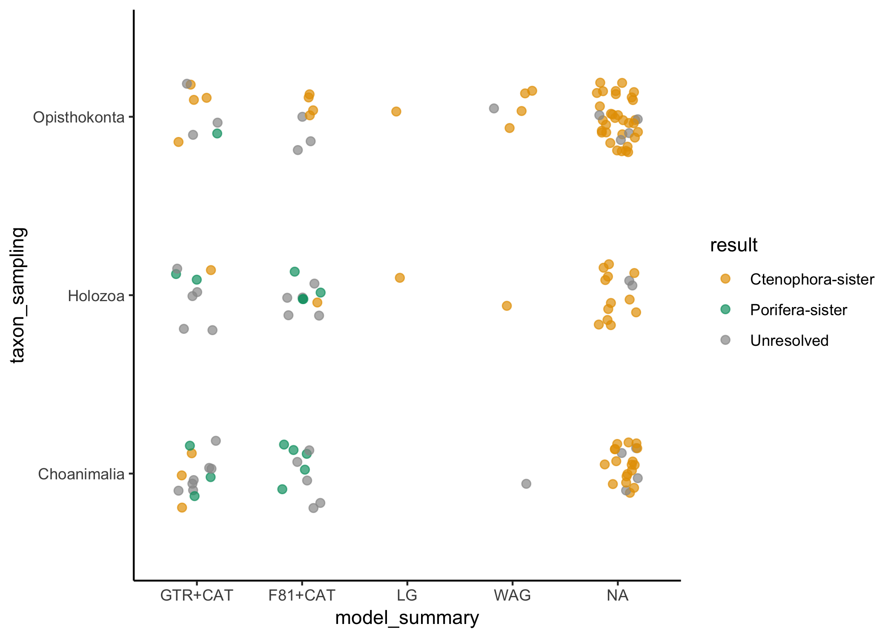

Rooting the animal tree of life
===============================

Casey W. Dunn1\*, Benjamin Evans2, and Yuanning Li1

1Department of Ecology and Evolutionary Biology, Yale University

2Yale Center for Research Computing, Yale University

\* Corresponding author, <casey.dunn@yale.edu>

Abstract
--------

Introduction
------------

In the past decade there has been considerable debate about the position of the root of the animal phylogeny, with Ctenophora-sister and Porifera-sister (Fig XXOverview) emerging as the two primary hypotheses. Historically, there was little debate about the root of the animal tree of life and Porifera-sister was widely accepted though rarely tested. In contrast to the lack of debate about the position of Porifera, there has long been uncertainty about the relationship of Ctenophora to other animals \[1\]. The first phylogenomic study to include ctenophores \[2\] suggested a new hypothesis, now referred to as Ctenophora-sister, that ctenophores are our most distant animal relative. Since then many more studies have been published, some supporting Ctenophora-sister, some Porifera-sister, and some neither. As it has become clear that this is a very difficult phylogenetic challenge, and the problem has become better characterized, it has become an interesting test-case to phylogenetic biologists beyond those concerned with this particular biological problem. Work has been hindered, though, because it has been difficult to directly compare results across studies and synthesize findings to understand the broader patterns of support. Here we synthesize data and results from all previous phylogenomic analyses that tested Ctenophora-sister and Porifera-sister, and reanalyze these data using standardized methods, and perform new analyses to characterize differences between studies. We hope that this provides an integrative overview of the challenge and provides direction for future studies. We also hope that the work we have done here, including consolidating all the datasets in one place with consistent formats and species names, will enhance the technical value of this interesting question to methods-focused investigators that look to develop methods to address difficult phylogenetic problems.

 **Fig XXOverview.** (A) The Ctenophora-sister hypothesis posits that there is a clade (designated by the orange node) that includes all animals except Ctenophora, and that Ctenophora is sister to this clade. (B) The Porifera-sister hypothesis posits that there is a clade (designated by the green node) that includes all animals except Porifera, and that Porifera is sister to this clade. Testing these hypotheses requires evaluating the support for each of these alternative nodes. (C) A ctenophore. (D) A sponge.

Variation across studies
------------------------

### Models of molecular evolution

Models of molecular evolution have several components that each consider different aspects of the evolutionary process. The models that have been used to model protein evolution in studies of the animal root have largely differed according to three components: the exchangeability matrix *E*, the rate of evolution, and the state equilibrium frequencies *Π*.

The exchangeability matrix *E* describes the rate at which one amino acid changes to another. Exchangeability matrices have been used in the studies under consideration here include:

-   F81 \[3\] corresponds to equal rates between all states. The F81 matrix is also sometimes referred to as the Poisson matrix. It has no free parameters to estimate since all off-diagonal elements are set to 1.

-   WAG \[4\] is an empirically derived exchangeability matrix based on a dataset of 182 globular protein families. It has no free parameters to estimate since all off-diagonal elements are set according to values estimated from this particular sample dataset.

-   LG \[5\], like WAG, is an empirically derived exchangeability matrix. It is based on a much larger set of genes, and variation in rates across sites was taken into consideration when it was calculated. It has no free parameters to estimate since all off-diagonal elements are set according to values estimated from this particular sample dataset.

-   GTR, the General Time Reversible exchangeability matrix, has free parameters for all off-diagonal elements that describe the exchangeability of different amino acids. It is constrained so that changes are reversible, *i.e.* the rates above the diagonal are the same as those below the diagonal. This leaves 190 parameters that must be estimated from the data long with the other model parameters and the phylogenetic tree topology. This estimation requires a considerable amount of data and computational power, but if successful has the advantage of being based on the dataset at hand rather than a different dataset (as for LG and WAG).

While the exchangeability matrix describes the relative rate of different changes between amino acids, the actual rate can be further scaled. There are couple approaches that have been used in the studies considered here:

-   Site homogeneous rates. The rates of evolution are assumed to be the same at all sites in the amino acid alignment.

-   Gamma rate heterogeneity. Each site is assigned to a different rate class with its own rate value. This accommodates different rates of evolution across different sites. Gamma is used so commonly that sometimes it isn't even specified, making it difficult at times to know if a study uses Gamma or not.

The vector of equilibrium frequencies *Π* describes the stationary frequency of amino acids. There are a few approaches that have been used across the studies considered here:

-   Empirical site homogeneous. The frequency of each amino acid is observed from the matrix under consideration and applied to homogeneously to all sites in the matrix.

-   Estimated site homogeneous. The frequency of each amino acid is inferred along with other model parameters, under the assumption that it is the same at all sites.

-   CAT site heterogeneous \[6\]. Each site is assigned to a class with its own equilibrium frequencies. The number of classes, assignment of sites to classes, and equilibrium frequencies within the data are all estimated in a Bayesian framework.

Models can be assembled by selecting different options for all these different components. The models that are applied in practice area heavily influenced by engineering and computational costs, as well as convention. For example, on the questions considered here F81 and GTR exchangeability matrices have only been used in combination with CAT site heterogeneous models of equilibrium frequency. LG and WAG exchangeability matrices have only been used with site homogeneous estimates of equilibrium frequency. This is further confused by the abbreviations that are used for models. Papers often discuss CAT and WAG models as if they are exclusive, but these particular terms apply to non-exclusive model components-- CAT refers to variation across sites and WAG a particular exchangeability matrix. CAT is generally shorthand for F81+CAT and WAG is shorthand for WAG+homogeneous equilibrium frequency estimation. One could, though, run a WAG+CAT model.

To avoid confusion on this point, we always specify the exchangeability matrix first, followed by modifiers that describe accommodation of heterogeneity in equilibrium frequencies (*e.g.*, CAT) or rate (*e.g.*, Gamma). If there are no modifiers, then it is implied that site homogeneous models are used.

### Gene sampling

### Outgroup taxon sampling

XXX

**Fig XXOutgroup.** The animals and their outgroups, showing the three progressively more inclusive clades Choanimalia, Holozoa, and Opisthokonta.

Choanimalia, Holozoa, Opisthokonta

### Ingroup taxon sampling

Sensitivity to ingroup sampling has received less attention than sensitivity to outgroup sampling. This may be because results have tended to be more sensitive to outgroup sampling.

Overview of published analyses
------------------------------

### Alignment composition

XXX

**Fig XXTaxon\_composition.** Each of the primary matrices considered here, color coded by taxon sampling. Horizontal size is proportional to the number of genes (XXOr should it be sites?) sampled, vertical size to the number of taxa sampled.

XXX

**Fig XXTaxon\_composition.** Each of the primary matrices considered here, color coded by the types of genes sampled (XX Ribosomal proteins, etc). Horizontal size is proportional to the number of genes sampled, vertical size to the number of taxa sampled.

### Alignment overlap

XXX

**Fig XXAlignment overlap.** Pairwise overlap between each of the primary matrices considered here. Horizontal size is proportional to the number of genes sampled, vertical size to the number of taxa sampled. The horizontal intersection shows the proportions of shared genes, the vertical intersection shows the proportions of shared taxa.

### Support for Porifera-sister and Ctenophora-sister

A total of 137 analyses were transcribed from the literature.

New analyses of published matrices
----------------------------------

One of the challenges of interpreting support for the placement of the animal root across studies is that different programs, software versions, and settings have been used across studies, and phylogenetic analysis decisions have been approached in very different ways. Here we reanalyze the primary matrices from each study under consistent conditions with iqtree. We selected this tool because it has greater model flexibility than other tools and is very fast.

We first tested a variety of models for each matrix, and inferred support under the selected model. We then analyzed every matrix under a panel of standard models, including XXX.

### Comparison of iqtree and phylobayes results

Site heterogeneity in equilibrium frequency has been a major concern in tests of Ctenophora-sister and Porifera-sister. This has been addressed with CAT models. iqtree provides a new family of C models that also address site heterogeneity. Given the extensive computational cost and concerns about overparameterization of CAT models, we compared iqtree C results to CAT results for a subset of matrices to see if they give consistent results. This would be of technical interest because it would reduce the cost of accommodating compositional heterogeneity in future analyses.

New analyses of new matrices
----------------------------

Based on the variation across analyses, we constructed new matrices with altered taxon and gene sampling to test specific hypotheses about differences in support.

The current state of understanding
----------------------------------

### Interpretting variation support

External criteria, eg posterior predictive scores, model fit etc

Next steps
----------

Conclusion
----------

Methods
-------

All files associated with this analysis are available at <https://github.com/caseywdunn/animal_root>

### Data wrangling

### Matrix comparison and annotation

### Phylogenetic analyses

Ackowledgements
---------------

Author contributions
--------------------

Supplemental Information
========================

Details of published analyses
-----------------------------

### Dunn *et al.* 2008

Dunn *et al.* \[2\] added Expressed Sequence Tag (EST) data for 29 animals. It was the first phylogenomic analysis that included ctenophores, and therefore that could test the relationships of both Ctenophora and Porifera to the rest of animals. It was the first phylogenetic analysis to recover Ctenophora as the sister group to all other animals.

The data matrix was constructed using a semi-automated approach. Genes were translated into proteins, promiscuous domains were masked, all gene sequences from all species were compared to each other with blastp, genes were clustered based on this similarity with TribeMCL \[7\], and these clusters were filtered to remove those with poor taxon sampling and high rates of lineage-specific duplications. Gene trees were then constructed, and in clades of sequences all from the same species all but one sequence were removed (these groups are often due to assembly errors). The remaining gene trees with more than one sequence for any taxon were then manually inspected. If strongly supported deep nodes indicative of paralogy were found, the entire gene was discarded. If the duplications for a a small number of taxa were unresolved, all genes from those taxa were excluded. Genes were then realigned and sites were filtered with Gblocks \[8\], resulting in a 77 taxon matrix. Some taxa in this matrix were quite unstable, which obscured other strongly-supported relationships. Unstable taxa were identified with leaf stability indices \[9\], as implemented in phyutility \[10\], and removed from the matrix. This resulted in the 64-taxon matrix that is the focus of most of their analyses. Phylogenetic analyses were conducted under the F81+CAT model in phylobayes \[6\], and under the WAG model in MrBayes \[11\] and RAxML \[12\].

Regarding the recovery of Ctenophora-sister, the authors concluded:

> The placement of ctenophores (comb jellies) as the sister group to all other sampled metazoans is strongly supported in all our analyses. This result, which has not been postulated before, should be viewed as provisional until more data are considered from placozoans and additional sponges.

Note that there was, in fact, an exception to strong support. An analysis of the 40 ribosomal proteins in the matrix recovered Ctenophora-sister with only 69% support. This study did not include *Trichoplax*.

### Philippe *et al.* 2009

Philippe *et al.* 2009 \[Philippe:2009hh\]...

### Hejnol et al. 2009

### Pick *et al.* 2010

Pick *et al.* \[13\] sought to test whether Ctenophora-sister was an artefact of insufficient taxon sampling. They added new and additional published sequence data to the 64-taxon matrix of Dunn *et al.* \[2\]. The new taxa included 12 sponges, 1 ctenophore, 5 cnidarians, and *Trichoplax*. They further modified the matrix by removing 2,150 sites that were poorly sampled or aligned. They considered two different sets of outgroups: Choanoflagellata (resulting in Choanimalia) and the same sampling as Dunn *et al.* (resulting in Opisthokonta).

All their analyses were conducted under the F81+CAT+Gamma model in phylobayes \[6\], in both a Bayesian framework and with bootstrapping. All analyses have the same ingroup sampling and site removal so it isn't possible to independently assess the impact of these factors. Analyses with Choanimalia sampling recovered Porifera-sister with 72% posterior probability (PP) and 91% bootstrap support (BS). With broader Opisthokonta sampling, support for Porifera-sister is 84% PP. This is an interesting case where increased outgroup sampling leads to increased support for Porifera-sister.

The authors argue that previous results supporting Ctenophora-sister "are artifacts stemming from insufficient taxon sampling and long-branch attraction (LBA)" and that "this hypothesis should be rejected". Although the posterior probabilities supporting Porifera-sister are not strong, they conclude:

> Results of our analyses indicate that sponges are the sister group to the remaining Metazoa, and Placozoa are sister group to the Bilateria

They also investigated saturation, and conclude that Dunn *et al.* \[2\] is more saturated than Philippe *et al.* 2009 \[Philippe:2009hh\]. Note that the Pick *et al.* \[13\] dataset is not reanalyzed here because partition data are not available, and due to site filtering the partition file from Dunn *et al.* \[2\] cannot be applied to this matrix.

Matrix mapping
--------------

Taxa and partition correspondence across manuscripts was assessed by comparing all sequences for each taxon in each partition across all matrices with diamond blast. Based on inspection of sequence similarity, we excluded all comparisons with less than 99% identity and greater than 10-25 e-value.

### Taxa

The primary intent of comparing taxa across matrices was to validate our taxon name reconciliation across studies.

We first considered pairwise similarity between the same species from different matrices in different studies.

45052 raw pairwise comparisons passed the similarity thresholds under these sampling criteria. These included multiple hits for the same sequence pairs from different regions. When only a single hit is retained, there are 4646 retained sequence pairs.

We next considered taxon mapping more generally.

    ## # A tibble: 11,218 x 7
    ##    mscript1   dataset1     taxon1     mscript2  dataset2    taxon2   count
    ##    <chr>      <chr>        <chr>      <chr>     <chr>       <chr>    <int>
    ##  1 Hejnol2009 Hejnol2009   Capitella… Borowiec… Total1080   Capitel…   127
    ##  2 Borowiec2… Total1080    Capitella… Hejnol20… Hejnol2009  Capitel…   125
    ##  3 Hejnol2009 Hejnol2009   Daphnia_p… Borowiec… Total1080   Daphnia…   112
    ##  4 Borowiec2… Total1080    Daphnia_m… Hejnol20… Hejnol2009  Daphnia…   110
    ##  5 Ryan2013   est.opistho… Capitella… Borowiec… Total1080   Capitel…    57
    ##  6 Nosenko20… ribosomal_1… Hydra_mag… Chang2015 Chang2015   Hydra_v…    56
    ##  7 Nosenko20… ribosomal_1… Capitella… Chang2015 Chang2015   Capitel…    55
    ##  8 Borowiec2… Total1080    Capitella… Ryan2013  est.opisth… Capitel…    53
    ##  9 Borowiec2… Total1080    Mnemiopsi… Ryan2013  est.opisth… Mnemiop…    53
    ## 10 Chang2015  Chang2015    Capitella… Nosenko2… ribosomal_… Capitel…    53
    ## # ... with 11,208 more rows

    ## # A tibble: 4,646 x 7
    ##    mscript1   dataset1 taxon1      mscript2  dataset2     taxon2     count
    ##    <chr>      <chr>    <chr>       <chr>     <chr>        <chr>      <int>
    ##  1 Borowiec2… Best108  Acropora_d… Moroz2014 ED3d         Acropora_…     1
    ##  2 Borowiec2… Best108  Branchiost… Moroz2014 ED3d         Branchios…     1
    ##  3 Borowiec2… Best108  Branchiost… Nosenko2… ribosomal_1… Branchios…     1
    ##  4 Borowiec2… Best108  Drosophila… Moroz2014 ED3d         Drosophil…     1
    ##  5 Borowiec2… Best108  Homo_sapie… Whelan20… Metazoa_Cho… Homo_sapi…     1
    ##  6 Borowiec2… Best108  Ixodes_sca… Nosenko2… ribosomal_1… Ixodes_sc…     1
    ##  7 Borowiec2… Best108  Ixodes_sca… Nosenko2… ribosomal_1… Ixodes_sc…     1
    ##  8 Borowiec2… Best108  Ixodes_sca… Philippe… Philippe2009 Ixodes_sc…     1
    ##  9 Borowiec2… Best108  Monosiga_b… Moroz2014 ED3d         Monosiga_…     1
    ## 10 Borowiec2… Best108  Nematostel… Moroz2014 ED3d         Nematoste…     1
    ## # ... with 4,636 more rows

### Partitions

    ## # A tibble: 2,628 x 4
    ## # Groups:   mscript, dataset [19]
    ##     mscript      dataset                              cluster     n
    ##     <chr>        <chr>                                  <dbl> <int>
    ##   1 Whelan2017   Metazoa_full                              54    13
    ##   2 Philippe2009 Philippe2009                              37     7
    ##   3 Nosenko2013  ribosomal_11057_smatrix                  202     6
    ##   4 Nosenko2013  ribosomal_14615_smatrix                  202     6
    ##   5 Philippe2009 Philippe2009                              51     6
    ##   6 Whelan2017   Metazoa_full                               9     6
    ##   7 Chang2015    Chang2015                                202     5
    ##   8 Philippe2009 Philippe2009                              90     5
    ##   9 Philippe2009 Philippe2009                             202     5
    ##  10 Philippe2009 Philippe2009                             397     5
    ##  11 Ryan2013     est.opisthokonta                          51     5
    ##  12 Ryan2013     est.opisthokonta                          90     5
    ##  13 Simion2017   supermatrix_97sp_401632pos_1719genes      37     5
    ##  14 Simion2017   supermatrix_97sp_401632pos_1719genes      51     5
    ##  15 Simion2017   supermatrix_97sp_401632pos_1719genes      90     5
    ##  16 Chang2015    Chang2015                                431     4
    ##  17 Dunn2008     Dunn2008                                  51     4
    ##  18 Simion2017   supermatrix_97sp_401632pos_1719genes      54     4
    ##  19 Whelan2017   Metazoa_full                              85     4
    ##  20 Whelan2017   Metazoa_full                             202     4
    ##  21 Whelan2017   Metazoa_full                             431     4
    ##  22 Whelan2017   Metazoa_full                             654     4
    ##  23 Borowiec2015 Best108                                   37     3
    ##  24 Borowiec2015 Best108                                   51     3
    ##  25 Borowiec2015 Total1080                                 15     3
    ##  26 Borowiec2015 Total1080                                 37     3
    ##  27 Borowiec2015 Total1080                                 51     3
    ##  28 Dunn2008     Dunn2008                                 202     3
    ##  29 Hejnol2009   Hejnol2009                                51     3
    ##  30 Nosenko2013  ribosomal_11057_smatrix                   15     3
    ##  31 Nosenko2013  ribosomal_14615_smatrix                   15     3
    ##  32 Philippe2009 Philippe2009                              15     3
    ##  33 Philippe2009 Philippe2009                             398     3
    ##  34 Philippe2009 Philippe2009                             443     3
    ##  35 Ryan2013     est.opisthokonta                         202     3
    ##  36 Whelan2017   Metazoa_full                             159     3
    ##  37 Whelan2017   Metazoa_full                             389     3
    ##  38 Borowiec2015 Best108                                   96     2
    ##  39 Borowiec2015 Total1080                                  9     2
    ##  40 Borowiec2015 Total1080                                 90     2
    ##  41 Borowiec2015 Total1080                                 96     2
    ##  42 Borowiec2015 Total1080                                159     2
    ##  43 Borowiec2015 Total1080                                202     2
    ##  44 Chang2015    Chang2015                                 51     2
    ##  45 Chang2015    Chang2015                                 68     2
    ##  46 Chang2015    Chang2015                                 78     2
    ##  47 Chang2015    Chang2015                                 90     2
    ##  48 Chang2015    Chang2015                                394     2
    ##  49 Chang2015    Chang2015                                397     2
    ##  50 Chang2015    Chang2015                                398     2
    ##  51 Chang2015    Chang2015                                408     2
    ##  52 Chang2015    Chang2015                                411     2
    ##  53 Chang2015    Chang2015                                413     2
    ##  54 Chang2015    Chang2015                                426     2
    ##  55 Chang2015    Chang2015                                430     2
    ##  56 Chang2015    Chang2015                                443     2
    ##  57 Chang2015    Chang2015                                465     2
    ##  58 Dunn2008     Dunn2008                                  15     2
    ##  59 Dunn2008     Dunn2008                                 413     2
    ##  60 Hejnol2009   Hejnol2009                                 9     2
    ##  61 Moroz2014    ED3a                                     202     2
    ##  62 Moroz2014    ED3a                                     465     2
    ##  63 Nosenko2013  ribosomal_11057_smatrix                   68     2
    ##  64 Nosenko2013  ribosomal_11057_smatrix                  408     2
    ##  65 Nosenko2013  ribosomal_11057_smatrix                  411     2
    ##  66 Nosenko2013  ribosomal_11057_smatrix                  413     2
    ##  67 Nosenko2013  ribosomal_11057_smatrix                  426     2
    ##  68 Nosenko2013  ribosomal_11057_smatrix                  430     2
    ##  69 Nosenko2013  ribosomal_11057_smatrix                  431     2
    ##  70 Nosenko2013  ribosomal_14615_smatrix                   68     2
    ##  71 Nosenko2013  ribosomal_14615_smatrix                   78     2
    ##  72 Nosenko2013  ribosomal_14615_smatrix                  394     2
    ##  73 Nosenko2013  ribosomal_14615_smatrix                  408     2
    ##  74 Nosenko2013  ribosomal_14615_smatrix                  411     2
    ##  75 Nosenko2013  ribosomal_14615_smatrix                  413     2
    ##  76 Nosenko2013  ribosomal_14615_smatrix                  426     2
    ##  77 Nosenko2013  ribosomal_14615_smatrix                  430     2
    ##  78 Nosenko2013  ribosomal_14615_smatrix                  431     2
    ##  79 Philippe2009 Philippe2009                              68     2
    ##  80 Philippe2009 Philippe2009                             171     2
    ##  81 Philippe2009 Philippe2009                             394     2
    ##  82 Philippe2009 Philippe2009                             410     2
    ##  83 Philippe2009 Philippe2009                             418     2
    ##  84 Philippe2009 Philippe2009                             419     2
    ##  85 Philippe2009 Philippe2009                             422     2
    ##  86 Philippe2009 Philippe2009                             435     2
    ##  87 Philippe2009 Philippe2009                             464     2
    ##  88 Philippe2009 Philippe2009                             465     2
    ##  89 Philippe2009 Philippe2009                             628     2
    ##  90 Ryan2013     est.opisthokonta                           9     2
    ##  91 Ryan2013     est.opisthokonta                          15     2
    ##  92 Ryan2013     est.opisthokonta                          96     2
    ##  93 Simion2017   supermatrix_97sp_401632pos_1719genes       9     2
    ##  94 Simion2017   supermatrix_97sp_401632pos_1719genes     397     2
    ##  95 Simion2017   supermatrix_97sp_401632pos_1719genes     411     2
    ##  96 Simion2017   supermatrix_97sp_401632pos_1719genes     431     2
    ##  97 Simion2017   supermatrix_97sp_401632pos_1719genes     654     2
    ##  98 Whelan2015   Dataset1_FullData                        397     2
    ##  99 Whelan2017   Metazoa_Choano_RCFV_strict               431     2
    ## 100 Whelan2017   Metazoa_Choano_RCFV_strict               670     2
    ## # ... with 2,528 more rows

    ## # A tibble: 849 x 2
    ##     cluster     n
    ##       <dbl> <int>
    ##   1     202    38
    ##   2      51    32
    ##   3      54    25
    ##   4      90    23
    ##   5       9    22
    ##   6      37    22
    ##   7     431    22
    ##   8      15    20
    ##   9     397    15
    ##  10      68    14
    ##  11      85    13
    ##  12     159    13
    ##  13      75    12
    ##  14     426    12
    ##  15      46    11
    ##  16      78    11
    ##  17     413    11
    ##  18      36    10
    ##  19      50    10
    ##  20      67    10
    ##  21     411    10
    ##  22      71     9
    ##  23      96     9
    ##  24     360     9
    ##  25     408     9
    ##  26     223     8
    ##  27     232     8
    ##  28     394     8
    ##  29     395     8
    ##  30     415     8
    ##  31     430     8
    ##  32     462     8
    ##  33     533     8
    ##  34     654     8
    ##  35      26     7
    ##  36      33     7
    ##  37     100     7
    ##  38     117     7
    ##  39     171     7
    ##  40     383     7
    ##  41     389     7
    ##  42     393     7
    ##  43     404     7
    ##  44     422     7
    ##  45     435     7
    ##  46     465     7
    ##  47     538     7
    ##  48     579     7
    ##  49       4     6
    ##  50      29     6
    ##  51      53     6
    ##  52      55     6
    ##  53      64     6
    ##  54      91     6
    ##  55     191     6
    ##  56     233     6
    ##  57     398     6
    ##  58     403     6
    ##  59     405     6
    ##  60     409     6
    ##  61     410     6
    ##  62     414     6
    ##  63     423     6
    ##  64     424     6
    ##  65     425     6
    ##  66     436     6
    ##  67     443     6
    ##  68     487     6
    ##  69     531     6
    ##  70     551     6
    ##  71     576     6
    ##  72     597     6
    ##  73     635     6
    ##  74       6     5
    ##  75      34     5
    ##  76      59     5
    ##  77      87     5
    ##  78      94     5
    ##  79     103     5
    ##  80     136     5
    ##  81     142     5
    ##  82     144     5
    ##  83     184     5
    ##  84     186     5
    ##  85     190     5
    ##  86     197     5
    ##  87     216     5
    ##  88     234     5
    ##  89     236     5
    ##  90     247     5
    ##  91     250     5
    ##  92     270     5
    ##  93     291     5
    ##  94     388     5
    ##  95     406     5
    ##  96     412     5
    ##  97     417     5
    ##  98     418     5
    ##  99     419     5
    ## 100     427     5
    ## # ... with 749 more rows

The count for a partition pair can be much arger than the number of genes in the matrix, which suggests that the count is the number of hsps rather than the number of sequences with hits.

There are 19 datasets. A gene that is perfectly sampled would form a cluster with this size. Very few clusters, though, are this size. This suggests that intersection of genes between matrices is low

References
----------

1. Wallberg A, Thollesson M, Farris J, Jondelius U. The phylogenetic position of the comb jellies (Ctenophora) and the importance of taxonomic sampling. Cladistics. 2004;20: 558–578. Available: <http://onlinelibrary.wiley.com/doi/10.1111/j.1096-0031.2004.00041.x/full>

2. Dunn CW, Hejnol A, Matus DQ, Pang K, Browne WE, Smith SA, et al. Broad phylogenomic sampling improves resolution of the animal tree of life. Nature. 2008;452: 745–749. doi:[10.1038/nature06614](https://doi.org/10.1038/nature06614)

3. Felsenstein J. Evolutionary trees from DNA sequences: a maximum likelihood approach. Journal of Molecular Evolution. 1981;17: 368–376. Available: <http://eutils.ncbi.nlm.nih.gov/entrez/eutils/elink.fcgi?dbfrom=pubmed&id=7288891&retmode=ref&cmd=prlinks>

4. Whelan S, Goldman N. A General Empirical Model of Protein Evolution Derived from Multiple Protein Families Using a Maximum-Likelihood Approach. Molecular Biology and Evolution. 2001;18: 691–699. doi:[10.1093/oxfordjournals.molbev.a003851](https://doi.org/10.1093/oxfordjournals.molbev.a003851)

5. Le SQ, Gascuel O. An improved general amino acid replacement matrix. Molecular Biology and Evolution. 2008;25: 1307–1320. doi:[10.1093/molbev/msn067](https://doi.org/10.1093/molbev/msn067)

6. Lartillot N. A Bayesian Mixture Model for Across-Site Heterogeneities in the Amino-Acid Replacement Process. Molecular Biology and Evolution. 2004;21: 1095–1109. doi:[10.1093/molbev/msh112](https://doi.org/10.1093/molbev/msh112)

7. Enright A, Van Dongen S, Ouzounis C. An efficient algorithm for large-scale detection of protein families. Nucleic Acids Research. Oxford University Press; 2002;30: 1575–1584. doi:[10.1093/nar/30.7.1575](https://doi.org/10.1093/nar/30.7.1575)

8. Castresana J. Selection of conserved blocks from multiple alignments for their use in phylogenetic analysis. Molecular Biology and Evolution. 2000;17: 540–552. Available: [http://www.ncbi.nlm.nih.gov/entrez/query.fcgi?cmd=Retrieve&db=PubMed&dopt=Citation&list\_uids=10742046 ](http://www.ncbi.nlm.nih.gov/entrez/query.fcgi?cmd=Retrieve&db=PubMed&dopt=Citation&list_uids=10742046 )

9. Thorley J, Wilkinson M. Testing the phylogenetic stability of early tetrapods. Journal of Theoretical Biology. 1999;200: 343–344. doi:[10.1006/jtbi.1999.0999](https://doi.org/10.1006/jtbi.1999.0999)

10. Smith SA, Dunn CW. Phyutility: a phyloinformatics tool for trees, alignments and molecular data. Bioinformatics. Oxford University Press; 2008;24: 715–716. doi:[10.1093/bioinformatics/btm619](https://doi.org/10.1093/bioinformatics/btm619)

11. Ronquist F, Huelsenbeck JP. MrBayes 3: Bayesian phylogenetic inference under mixed models. Bioinformatics. 2003;19: 1572–1574. doi:[10.1093/bioinformatics/btg180](https://doi.org/10.1093/bioinformatics/btg180)

12. Stamatakis A. RAxML-VI-HPC: maximum likelihood-based phylogenetic analyses with thousands of taxa and mixed models. Bioinformatics. 2006;22: 2688–2690. doi:[10.1093/bioinformatics/btl446](https://doi.org/10.1093/bioinformatics/btl446)

13. Pick KS, Philippe H, Schreiber F, Erpenbeck D, Jackson DJ, Wrede P, et al. Improved phylogenomic taxon sampling noticeably affects nonbilaterian relationships. Molecular Biology and Evolution. 2010;27: 1983–1987. doi:[10.1093/molbev/msq089](https://doi.org/10.1093/molbev/msq089)
