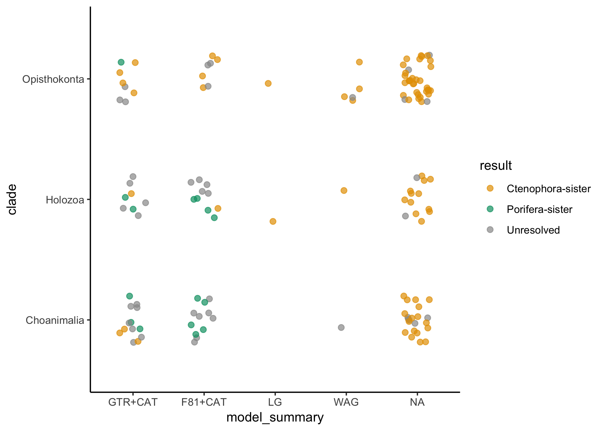

# Rooting the animal tree of life

Casey W. Dunn<sup>1</sup>\*, Benjamin Evans<sup>2</sup>, and Yuanning
Li<sup>1</sup>

<sup>1</sup>Department of Ecology and Evolutionary Biology, Yale
University

<sup>2</sup>Yale Center for Research Computing, Yale University

\* Corresponding author, <casey.dunn@yale.edu>

## Abstract

## Introduction

In the past decade there has been considerable debate about the position
of the root of the animal phylogeny, with Ctenophora-sister and
Porifera-sister (Fig XXOverview) emerging as the two primary hypotheses.
Historically, there was little debate about the root of the animal tree
of life and Porifera-sister was widely accepted though rarely tested. In
contrast to the lack of debate about the position of Porifera, there has
long been uncertainty about the relationship of Ctenophora to other
animals \[1\]. The first phylogenomic study to include ctenophores \[2\]
suggested a new hypothesis, now referred to as Ctenophora-sister, that
ctenophores are our most distant animal relative. Since then many more
studies have been published, some supporting Ctenophora-sister, some
Porifera-sister, and some neither. As it has become clear that this is a
very difficult phylogenetic challenge, and the problem has become better
characterized, it has become an interesting test-case to phylogenetic
biologists beyond those concerned with this particular biological
problem. Work has been hindered, though, because it has been difficult
to directly compare results across studies and synthesize findings to
understand the broader patterns of support. Here we synthesize data and
results from all previous phylogenomic analyses that tested
Ctenophora-sister and Porifera-sister, and reanalyze these data using
standardized methods, and perform new analyses to characterize
differences between studies. We hope that this provides an integrative
overview of the challenge and provides direction for future studies. We
also hope that the work we have done here, including consolidating all
the datasets in one place with consistent formats and species names,
will enhance the technical value of this interesting question to
methods-focused investigators that look to develop methods to address
difficult phylogenetic problems.

 **Fig XXOverview.** (A) The
Ctenophora-sister hypothesis posits that there is a clade (designated by
the orange node) that includes all animals except Ctenophora, and that
Ctenophora is sister to this clade. (B) The Porifera-sister hypothesis
posits that there is a clade (designated by the green node) that
includes all animals except Porifera, and that Porifera is sister to
this clade. Testing these hypotheses requires evaluating the support for
each of these alternative nodes. (C) A ctenophore. (D) A sponge.

## Variation across studies

### Models of molecular evolution

Models of molecular evolution have several components that each consider
different aspects of the evolutionary process. The models that have been
used to model protein evolution in studies of the animal root have
largely differed according to three components: the exchangeability
matrix \(E\), the rate of evolution, and the state equilibrium
frequencies \(\Pi\).

The exchangeability matrix \(E\) describes the rate at which one amino
acid changes to another. Exchangeability matrices have been used in the
studies under consideration here include:

  - F81 \[3\] corresponds to equal rates between all states. The F81
    matrix is also sometimes referred to as the Poisson matrix. It has
    no free parameters to estimate since all off-diagonal elements are
    set to 1.

  - WAG \[4\] is an empirically derived exchangeability matrix based on
    a dataset of 182 globular protein families. It has no free
    parameters to estimate since all off-diagonal elements are set
    according to values estimated from this particular sample dataset.

  - LG \[5\], like WAG, is an empirically derived exchangeability
    matrix. It is based on a much larger set of genes, and variation in
    rates across sites was taken into consideration when it was
    calculated. It has no free parameters to estimate since all
    off-diagonal elements are set according to values estimated from
    this particular sample dataset.

  - GTR, the General Time Reversible exchangeability matrix, has free
    parameters for all off-diagonal elements that describe the
    exchangeability of different amino acids. It is constrained so that
    changes are reversible, *i.e.* the rates above the diagonal are the
    same as those below the diagonal. This leaves 190 parameters that
    must be estimated from the data long with the other model parameters
    and the phylogenetic tree topology. This estimation requires a
    considerable amount of data and computational power, but if
    successful has the advantage of being based on the dataset at hand
    rather than a different dataset (as for LG and WAG).

While the exchangeability matrix describes the relative rate of
different changes between amino acids, the actual rate can be further
scaled. There are couple approaches that have been used in the studies
considered here:

  - Site homogeneous rates. The rates of evolution are assumed to be the
    same at all sites in the amino acid alignment.

  - Gamma rate heterogeneity. Each site is assigned to a different rate
    class with its own rate value. This accommodates different rates of
    evolution across different sites. Gamma is used so commonly that
    sometimes it isn’t even specified, making it difficult at times to
    know if a study uses Gamma or not.

The vector of equilibrium frequencies \(\Pi\) describes the stationary
frequency of amino acids. There are a few approaches that have been used
across the studies considered here:

  - Empirical site homogeneous. The frequency of each amino acid is
    observed from the matrix under consideration and applied to
    homogeneously to all sites in the matrix.

  - Estimated site homogeneous. The frequency of each amino acid is
    inferred along with other model parameters, under the assumption
    that it is the same at all sites.

  - CAT site heterogeneous \[6\]. Each site is assigned to a class with
    its own equilibrium frequencies. The number of classes, assignment
    of sites to classes, and equilibrium frequencies within the data are
    all estimated in a Bayesian framework.

Models can be assembled by selecting different options for all these
different components. The models that are applied in practice area
heavily influenced by engineering and computational costs, as well as
convention. For example, on the questions considered here F81 and GTR
exchangeability matrices have only been used in combination with CAT
site heterogeneous models of equilibrium frequency. LG and WAG
exchangeability matrices have only been used with site homogeneous
estimates of equilibrium frequency. This is further confused by the
abbreviations that are used for models. Papers often discuss CAT and WAG
models as if they are exclusive, but these particular terms apply to
non-exclusive model components– CAT refers to variation across sites and
WAG a particular exchangeability matrix. CAT is generally shorthand for
F81+CAT and WAG is shorthand for WAG+homogeneous equilibrium frequency
estimation. One could, though, run a WAG+CAT model.

To avoid confusion on this point, we always specify the exchangeability
matrix first, followed by modifiers that describe accommodation of
heterogeneity in equilibrium frequencies (*e.g.*, CAT) or rate (*e.g.*,
Gamma). If there are no modifiers, then it is implied that site
homogeneous models are used.

### Gene sampling

### Outgroup taxon sampling

XXX

**Fig XXOutgroup.** The animals and their outgroups, showing the three
progressively more inclusive clades Choanimalia, Holozoa, and
Opisthokonta.

Choanimalia, Holozoa, Opisthokonta

### Ingroup taxon sampling

Sensitivity to ingroup sampling has received less attention than
sensitivity to outgroup sampling. This may be because results have
tended to be more sensitive to outgroup sampling.

## Overview of published analyses

### Matrix taxon composition

\`\`\`{ r taxon\_rectangles }

taxon\_rectangles = lapply( sequence\_matrices, function (
sequence\_matrix ){ clade\_rects(sequence\_matrix) } ) %\>% bind\_rows()

clade\_colors = viridis( length(clades) ) names( clade\_colors ) =
clades

ggplot(data=taxon\_rectangles) + scale\_x\_continuous(name=“x”) +
scale\_y\_continuous(name=“y”) + geom\_rect( mapping=aes(xmin=xmin,
xmax=xmax, ymin=ymin, ymax=ymax, fill=clade )) + \#
scale\_fill\_manual(guide = guide\_legend(reverse=TRUE)) \#
scale\_fill\_manual(values = clade\_colors, guide =
guide\_legend(reverse=TRUE)) scale\_fill\_discrete(guide =
guide\_legend(reverse=TRUE)) + facet\_wrap( \~ manuscript\_matrix )

``` 


XXX

**Fig XXTaxon_composition.** Each of the primary matrices considered here, color coded by taxon sampling. Horizontal size is proportional to the number of genes (XXOr should it be sites?) sampled, vertical size to the number of taxa sampled.

### Matrix gene composition

```

## \# A tibble: 11 x 3

## \# Groups: matrix \[6\]

## matrix partition n

## <chr> <chr> <int>

## 1 Borowiec2015\_Total1080 OG621.fasta.aln\_gene687 2

## 2 Chang2015 l12e\_01 2

## 3 Philippe2009 rpl2 2

## 4 Simion2017 V2META12905-42-Calc\_Hmm10-BMGE05 2

## 5 Simion2017 V2META14417-42-Calc\_Hmm10-BMGE05 2

## 6 Simion2017 V2META14523-42-Calc\_Hmm10-BMGE05 2

## 7 Whelan2017\_full Subset18\_01 2

## 8 Whelan2017\_strict Subset19\_01 2

## 9 Whelan2017\_strict Subset4\_01 3

## 10 Whelan2017\_strict Subset5\_01 2

## 11 Whelan2017\_strict Subset9\_01 2

``` 

<!-- -->

**Fig XXBUSCO_annotations.** The number of partitions with BUSCO annotations in each matrix, relative to the number of partitions.


**Fig XXGene_composition.** Each of the primary matrices considered here, color coded by the types of genes sampled (XX Ribosomal proteins, etc). Horizontal size is proportional to the number of genes sampled, vertical size to the number of taxa sampled.

### Matrix overlap

<!-- -->


**Fig XXAlignment overlap.** Pairwise overlap between each of the primary matrices considered here. Horizontal size is proportional to the number of genes sampled, vertical size to the number of taxa sampled. The horizontal intersection shows the proportions of shared genes, the vertical intersection shows the proportions of shared taxa.


### Support for Porifera-sister and Ctenophora-sister

<!-- -->


A total of 139 analyses were transcribed from the literature.


## New analyses of published matrices


One of the challenges of interpreting support for the placement of the animal root across studies is that different programs, software versions, and settings have been used across studies, and phylogenetic analysis decisions have been approached in very different ways. Here we reanalyze the primary matrices from each study under consistent conditions with iqtree. We selected this tool because it has greater model flexibility than other tools and is very fast.

We first tested a variety of models for each matrix, and inferred support under the selected model. We then analyzed every matrix under a panel of standard models, including XXX.


### Comparison of iqtree and phylobayes results

Site heterogeneity in equilibrium frequency has been a major concern in tests of Ctenophora-sister and Porifera-sister. This has been addressed with CAT models. iqtree provides a new family of C models that also address site heterogeneity. Given the extensive computational cost and concerns about overparameterization of CAT models, we compared iqtree C results to CAT results for a subset of matrices to see if they give consistent results. This would be of technical interest because it would reduce the cost of accommodating compositional heterogeneity in future analyses.


## New analyses of new matrices

Based on the variation across analyses, we constructed new matrices with altered taxon and gene sampling to test specific hypotheses about differences in support.


## The current state of understanding

### Interpretting variation support

External criteria, eg posterior predictive scores, model fit etc

## Next steps

## Conclusion

## Methods

All files associated with this analysis are available at https://github.com/caseywdunn/animal_root


### Data wrangling

### Matrix comparison and annotation

### Phylogenetic analyses


## Ackowledgements


## Author contributions


\pagebreak

# Supplemental Information

## Details of published analyses

### Dunn *et al.* 2008

Dunn *et al.* [@Dunn:2008ky] added Expressed Sequence Tag (EST) data for 29 animals. It was the first phylogenomic analysis that included ctenophores, and therefore that could test the relationships of both Ctenophora and Porifera to the rest of animals. It was the first phylogenetic analysis to recover Ctenophora as the sister group to all other animals.

The data matrix was constructed using a semi-automated approach. Genes were translated into proteins, promiscuous domains were masked, all gene sequences from all species were compared to each other with blastp, genes were clustered based on this similarity with TribeMCL [@Enright:2002uq], and these clusters were filtered to remove those with poor taxon sampling and high rates of lineage-specific duplications. Gene trees were then constructed, and in clades of sequences all from the same species all but one sequence were removed (these groups are often due to assembly errors). The remaining gene trees with more than one sequence for any taxon were then manually inspected. If strongly supported deep nodes indicative of paralogy were found, the entire gene was discarded. If the duplications for a a small number of taxa were unresolved, all genes from those taxa were excluded. Genes were then realigned and sites were filtered with Gblocks [@Castresana:2000vy], resulting in a 77 taxon matrix. Some taxa in this matrix were quite unstable, which obscured other strongly-supported relationships. Unstable taxa were identified with leaf stability indices [@Thorley:1999kg], as implemented in phyutility [@Smith:2008gb], and removed from the matrix. This resulted in the 64-taxon matrix that is the focus of most of their analyses. Phylogenetic analyses were conducted under the F81+CAT model in phylobayes [@Lartillot:2004dq], and under the WAG model in MrBayes [@Ronquist:2003hx] and RAxML [@Stamatakis:2006wc].

Regarding the recovery of Ctenophora-sister, the authors concluded:

> The placement of ctenophores (comb jellies) as the sister group to all other sampled metazoans is strongly supported in all our analyses. This result, which has not been postulated before, should be viewed as provisional until more data are considered from placozoans and additional sponges.

Note that there was, in fact, an exception to strong support. An analysis of the 40 ribosomal proteins in the matrix recovered Ctenophora-sister with only 69% support. This study did not include *Trichoplax*.

### Philippe *et al.* 2009

Philippe *et al.* 2009 [Philippe:2009hh]...

### Hejnol et al. 2009


### Pick *et al.* 2010

Pick *et al.* [@Pick:2010eb] sought to test whether Ctenophora-sister was an artefact of insufficient taxon sampling. They added new and additional published sequence data to the 64-taxon matrix of Dunn *et al.* [@Dunn:2008ky]. The new taxa included 12 sponges, 1 ctenophore, 5 cnidarians, and *Trichoplax*. They further modified the matrix by removing 2,150 sites that were poorly sampled or aligned. They considered two different sets of outgroups: Choanoflagellata (resulting in Choanimalia) and the same sampling as Dunn *et al.* (resulting in Opisthokonta).

All their analyses were conducted under the F81+CAT+Gamma model in phylobayes [@Lartillot:2004dq], in both a Bayesian framework and with bootstrapping. All analyses have the same ingroup sampling and site removal so it isn't possible to independently assess the impact of these factors. Analyses with Choanimalia sampling recovered Porifera-sister with 72% posterior probability (PP) and 91% bootstrap support (BS). With broader Opisthokonta sampling, support for Porifera-sister is 84% PP. This is an interesting case where increased outgroup sampling leads to increased support for Porifera-sister.

The authors argue that previous results supporting Ctenophora-sister "are artifacts stemming from insufficient taxon sampling and long-branch attraction (LBA)" and that "this hypothesis should be rejected". Although the posterior probabilities supporting Porifera-sister are not strong, they conclude:

> Results of our analyses indicate that sponges are the sister group to the remaining Metazoa, and Placozoa are sister group to the Bilateria

They also investigated saturation, and conclude that Dunn *et al.* [@Dunn:2008ky] is more saturated than Philippe *et al.* 2009 [Philippe:2009hh]. Note that the Pick *et al.* [@Pick:2010eb] dataset is not reanalyzed here because partition data are not available, and due to site filtering the partition file from Dunn *et al.* [@Dunn:2008ky] cannot be applied to this matrix.

## Matrix mapping

Taxa and partition correspondence across manuscripts was assessed by comparing all sequences for each taxon in each partition across all matrices with diamond blast. Based on inspection of sequence similarity, we excluded all comparisons with less than 99% identity and greater than 10^-25^ e-value.


### Taxa comparison across matrices

The primary intent of comparing taxa across matrices was to validate our taxon name reconciliation across studies. 

We first considered pairwise similarity between the same species from different matrices in different studies.


### Partition comparison across matrices


```

## \# A tibble: 2,372 x 3

## \# Groups: matrix \[17\]

## matrix cluster n

## <chr> <dbl> <int>

## 1 Whelan2017\_full 54 13

## 2 Philippe2009 37 7

## 3 Nosenko2013\_ribo\_11057 193 6

## 4 Nosenko2013\_ribo\_14615 193 6

## 5 Philippe2009 51 6

## 6 Whelan2017\_full 9 6

## 7 Chang2015 193 5

## 8 Philippe2009 90 5

## 9 Philippe2009 193 5

## 10 Philippe2009 375 5

## 11 Ryan2013\_est 51 5

## 12 Ryan2013\_est 90 5

## 13 Simion2017 37 5

## 14 Simion2017 51 5

## 15 Simion2017 90 5

## 16 Chang2015 408 4

## 17 Dunn2008 51 4

## 18 Simion2017 54 4

## 19 Whelan2017\_full 85 4

## 20 Whelan2017\_full 193 4

## 21 Whelan2017\_full 408 4

## 22 Whelan2017\_full 593 4

## 23 Borowiec2015\_Best108 37 3

## 24 Borowiec2015\_Best108 51 3

## 25 Borowiec2015\_Total1080 15 3

## 26 Borowiec2015\_Total1080 37 3

## 27 Borowiec2015\_Total1080 51 3

## 28 Dunn2008 193 3

## 29 Hejnol2009 51 3

## 30 Nosenko2013\_ribo\_11057 15 3

## 31 Nosenko2013\_ribo\_14615 15 3

## 32 Philippe2009 15 3

## 33 Philippe2009 376 3

## 34 Philippe2009 420 3

## 35 Ryan2013\_est 193 3

## 36 Whelan2017\_full 154 3

## 37 Whelan2017\_full 367 3

## 38 Borowiec2015\_Best108 96 2

## 39 Borowiec2015\_Total1080 9 2

## 40 Borowiec2015\_Total1080 90 2

## 41 Borowiec2015\_Total1080 96 2

## 42 Borowiec2015\_Total1080 154 2

## 43 Borowiec2015\_Total1080 193 2

## 44 Chang2015 51 2

## 45 Chang2015 68 2

## 46 Chang2015 78 2

## 47 Chang2015 90 2

## 48 Chang2015 372 2

## 49 Chang2015 375 2

## 50 Chang2015 376 2

## 51 Chang2015 386 2

## 52 Chang2015 389 2

## 53 Chang2015 391 2

## 54 Chang2015 403 2

## 55 Chang2015 407 2

## 56 Chang2015 420 2

## 57 Chang2015 442 2

## 58 Dunn2008 15 2

## 59 Dunn2008 391 2

## 60 Hejnol2009 9 2

## 61 Nosenko2013\_ribo\_11057 68 2

## 62 Nosenko2013\_ribo\_11057 386 2

## 63 Nosenko2013\_ribo\_11057 389 2

## 64 Nosenko2013\_ribo\_11057 391 2

## 65 Nosenko2013\_ribo\_11057 403 2

## 66 Nosenko2013\_ribo\_11057 407 2

## 67 Nosenko2013\_ribo\_11057 408 2

## 68 Nosenko2013\_ribo\_14615 68 2

## 69 Nosenko2013\_ribo\_14615 78 2

## 70 Nosenko2013\_ribo\_14615 372 2

## 71 Nosenko2013\_ribo\_14615 386 2

## 72 Nosenko2013\_ribo\_14615 389 2

## 73 Nosenko2013\_ribo\_14615 391 2

## 74 Nosenko2013\_ribo\_14615 403 2

## 75 Nosenko2013\_ribo\_14615 407 2

## 76 Nosenko2013\_ribo\_14615 408 2

## 77 Philippe2009 68 2

## 78 Philippe2009 165 2

## 79 Philippe2009 372 2

## 80 Philippe2009 388 2

## 81 Philippe2009 396 2

## 82 Philippe2009 397 2

## 83 Philippe2009 399 2

## 84 Philippe2009 412 2

## 85 Philippe2009 441 2

## 86 Philippe2009 442 2

## 87 Philippe2009 569 2

## 88 Ryan2013\_est 9 2

## 89 Ryan2013\_est 15 2

## 90 Ryan2013\_est 96 2

## 91 Simion2017 9 2

## 92 Simion2017 375 2

## 93 Simion2017 389 2

## 94 Simion2017 408 2

## 95 Simion2017 593 2

## 96 Whelan2015\_D1 375 2

## 97 Whelan2017\_full 71 2

## 98 Whelan2017\_full 90 2

## 99 Whelan2017\_full 592 2

## 100 Whelan2017\_full 777 2

## \# … with 2,272 more rows

``` 
```

## \# A tibble: 789 x 2

## cluster n

## <dbl> <int>

## 1 193 36

## 2 51 31

## 3 54 22

## 4 90 22

## 5 408 22

## 6 9 20

## 7 15 20

## 8 37 20

## 9 68 14

## 10 375 14

## 11 85 13

## 12 154 13

## 13 75 11

## 14 78 11

## 15 391 11

## 16 403 11

## 17 50 10

## 18 389 10

## 19 46 9

## 20 67 9

## 21 338 9

## 22 386 9

## 23 36 8

## 24 71 8

## 25 219 8

## 26 372 8

## 27 373 8

## 28 393 8

## 29 407 8

## 30 439 8

## 31 507 8

## 32 593 8

## 33 26 7

## 34 96 7

## 35 117 7

## 36 165 7

## 37 367 7

## 38 371 7

## 39 382 7

## 40 412 7

## 41 511 7

## 42 4 6

## 43 29 6

## 44 33 6

## 45 53 6

## 46 55 6

## 47 100 6

## 48 184 6

## 49 361 6

## 50 376 6

## 51 381 6

## 52 383 6

## 53 387 6

## 54 388 6

## 55 392 6

## 56 399 6

## 57 401 6

## 58 402 6

## 59 420 6

## 60 462 6

## 61 505 6

## 62 542 6

## 63 576 6

## 64 34 5

## 65 59 5

## 66 64 5

## 67 91 5

## 68 103 5

## 69 177 5

## 70 183 5

## 71 189 5

## 72 206 5

## 73 221 5

## 74 233 5

## 75 236 5

## 76 274 5

## 77 384 5

## 78 390 5

## 79 395 5

## 80 396 5

## 81 397 5

## 82 400 5

## 83 404 5

## 84 405 5

## 85 406 5

## 86 415 5

## 87 421 5

## 88 429 5

## 89 438 5

## 90 442 5

## 91 485 5

## 92 489 5

## 93 523 5

## 94 537 5

## 95 561 5

## 96 563 5

## 97 592 5

## 98 5 4

## 99 6 4

## 100 11 4

## \# … with 689 more rows

\`\`\`

The count for a partition pair can be much arger than the number of
genes in the matrix, which suggests that the count is the number of hsps
rather than the number of sequences with hits.

There are 17 matrices. A gene that is perfectly sampled would form a
cluster with this size. Very few clusters, though, are this size. This
suggests that intersection of genes between matrices is low

## References

<div id="refs" class="references">

<div id="ref-Wallberg:2004ws">

1\. Wallberg A, Thollesson M, Farris J, Jondelius U. The phylogenetic
position of the comb jellies (Ctenophora) and the importance of
taxonomic sampling. Cladistics. 2004;20: 558–578. Available:
<http://onlinelibrary.wiley.com/doi/10.1111/j.1096-0031.2004.00041.x/full>

</div>

<div id="ref-Dunn:2008ky">

2\. Dunn CW, Hejnol A, Matus DQ, Pang K, Browne WE, Smith SA, et al.
Broad phylogenomic sampling improves resolution of the animal tree of
life. Nature. 2008;452: 745–749.
doi:[10.1038/nature06614](https://doi.org/10.1038/nature06614)

</div>

<div id="ref-Felsenstein:1981vk">

3\. Felsenstein J. Evolutionary trees from DNA sequences: a maximum
likelihood approach. Journal of Molecular Evolution. 1981;17: 368–376.
Available:
<http://eutils.ncbi.nlm.nih.gov/entrez/eutils/elink.fcgi?dbfrom=pubmed&id=7288891&retmode=ref&cmd=prlinks>

</div>

<div id="ref-Whelan:2001ds">

4\. Whelan S, Goldman N. A General Empirical Model of Protein Evolution
Derived from Multiple Protein Families Using a Maximum-Likelihood
Approach. Molecular Biology and Evolution. 2001;18: 691–699.
doi:[10.1093/oxfordjournals.molbev.a003851](https://doi.org/10.1093/oxfordjournals.molbev.a003851)

</div>

<div id="ref-Le:2008fp">

5\. Le SQ, Gascuel O. An improved general amino acid replacement matrix.
Molecular Biology and Evolution. 2008;25: 1307–1320.
doi:[10.1093/molbev/msn067](https://doi.org/10.1093/molbev/msn067)

</div>

<div id="ref-Lartillot:2004dq">

6\. Lartillot N. A Bayesian Mixture Model for Across-Site
Heterogeneities in the Amino-Acid Replacement Process. Molecular Biology
and Evolution. 2004;21: 1095–1109.
doi:[10.1093/molbev/msh112](https://doi.org/10.1093/molbev/msh112)

</div>

</div>
