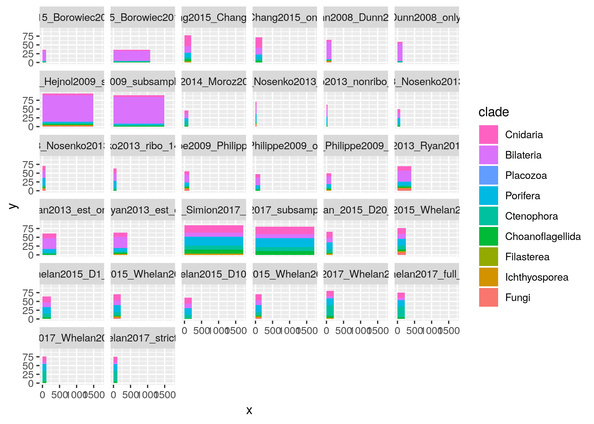
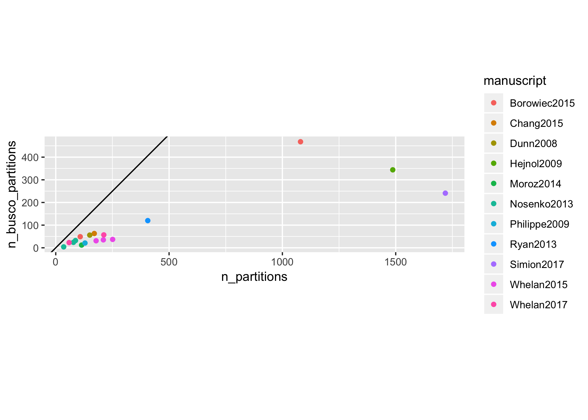
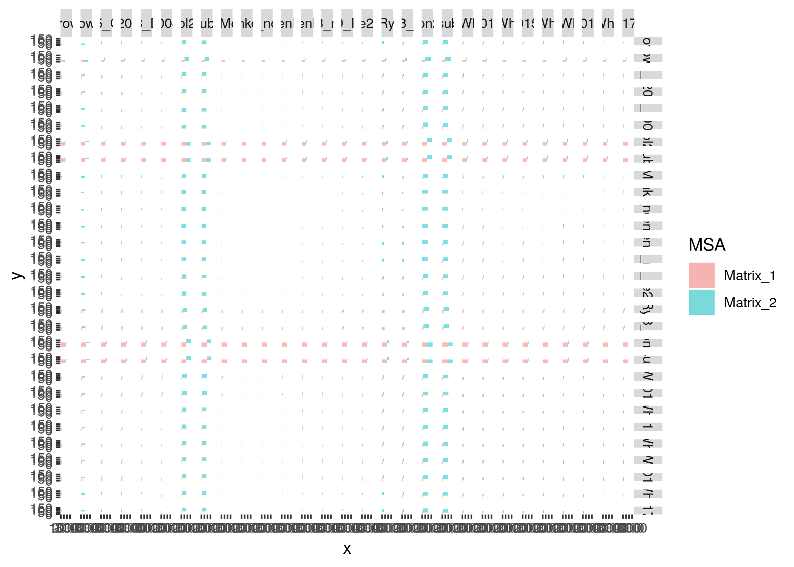
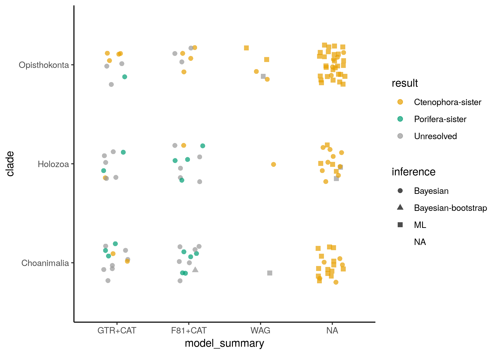
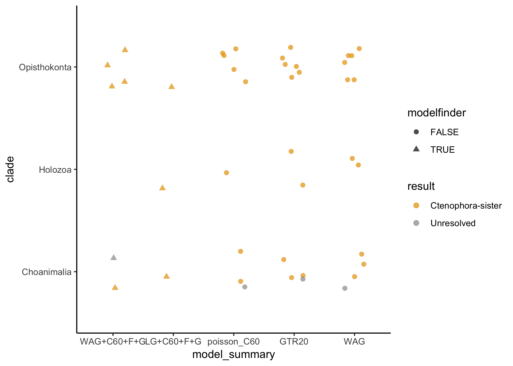
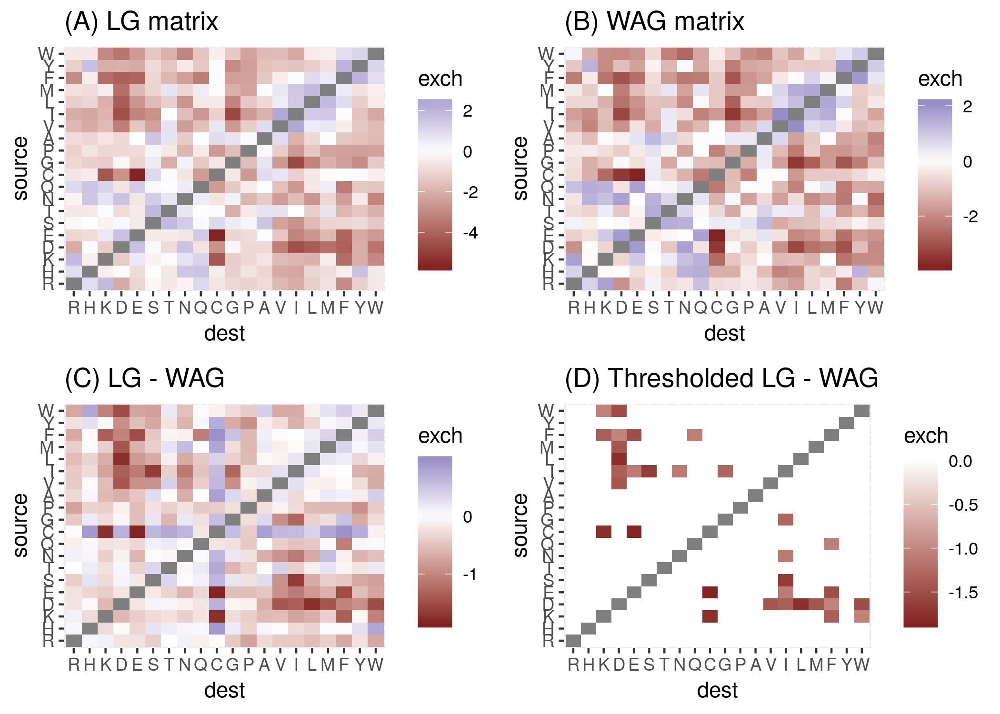

# Rooting the animal tree of life

Yuanning Li1, Xingxing Shen, Benjamin Evans2,
Antonis Rokas, and Casey W. Dunn1\*

1Department of Ecology and Evolutionary Biology, Yale
University

2Yale Center for Research Computing, Yale University

\* Corresponding author, <casey.dunn@yale.edu>

## Abstract

## Introduction

Over the past decade there has been considerable debate about the
position of the root of the animal phylogeny, with Ctenophora-sister and
Porifera-sister (Fig XXOverview) emerging as the two primary hypotheses.
Historically, there was little debate about the root of the animal tree
of life and Porifera-sister was widely accepted though rarely tested. In
contrast to the lack of debate about the position of Porifera, there has
long been uncertainty about the relationship of Ctenophora to other
animals \[1\].

The first phylogenomic study to include ctenophores \[2\] suggested a
new hypothesis, now referred to as Ctenophora-sister, that ctenophores
are our most distant animal relative. Since then many more studies have
been published, some supporting Ctenophora-sister, some Porifera-sister,
and some neither. As it has become clear that this is a very difficult
phylogenetic challenge, and the problem has become better characterized,
it has become an interesting test-case to phylogenetic biologists beyond
those concerned with this particular biological problem. Work has been
hindered, though, because it has been difficult to directly compare
results across studies and synthesize findings to understand the broader
patterns of support. Here we synthesize data and results from all
previous phylogenomic analyses that tested Ctenophora-sister and
Porifera-sister, and reanalyze these data using standardized methods,
and perform new analyses to characterize differences between studies. We
hope that this provides an integrative overview of the challenge and
provides direction for future studies. We also hope that the work we
have done here, including consolidating all the datasets in one place
with consistent formats and species names, will enhance the technical
value of this interesting question to methods-focused investigators that
look to develop methods to address difficult phylogenetic problems.

 **Fig XXOverview.** (A) The
Ctenophora-sister hypothesis posits that there is a clade (designated by
the orange node) that includes all animals except Ctenophora, and that
Ctenophora is sister to this clade. (B) The Porifera-sister hypothesis
posits that there is a clade (designated by the green node) that
includes all animals except Porifera, and that Porifera is sister to
this clade. Testing these hypotheses requires evaluating the support for
each of these alternative nodes. (C) A ctenophore. (D) A sponge.

## Variation across studies

### Models of molecular evolution

Models of molecular evolution have several components that each consider
different aspects of the evolutionary process. The models that have been
used to model protein evolution in studies of the animal root have
largely differed according to three components: the exchangeability
matrix \(E\), the rate of evolution, and the state equilibrium
frequencies \(\Pi\).

The exchangeability matrix \(E\) describes the rate at which one amino
acid changes to another. Exchangeability matrices have been used in the
studies under consideration here include:

  - F81 \[3\] corresponds to equal rates between all states. The F81
    matrix is also sometimes referred to as the Poisson matrix. It has
    no free parameters to estimate since all off-diagonal elements are
    set to 1.

  - WAG \[4\] is an empirically derived exchangeability matrix based on
    a dataset of 182 globular protein families. It has no free
    parameters to estimate since all off-diagonal elements are set
    according to values estimated from this particular sample dataset.

  - LG \[5\], like WAG, is an empirically derived exchangeability
    matrix. It is based on a much larger set of genes, and variation in
    rates across sites was taken into consideration when it was
    calculated. It has no free parameters to estimate since all
    off-diagonal elements are set according to values estimated from
    this particular sample dataset.

  - GTR, the General Time Reversible exchangeability matrix, has free
    parameters for all off-diagonal elements that describe the
    exchangeability of different amino acids. It is constrained so that
    changes are reversible, *i.e.* the rates above the diagonal are the
    same as those below the diagonal. This leaves 190 parameters that
    must be estimated from the data long with the other model parameters
    and the phylogenetic tree topology. This estimation requires a
    considerable amount of data and computational power, but if
    successful has the advantage of being based on the dataset at hand
    rather than a different dataset (as for LG and WAG).

While the exchangeability matrix describes the relative rate of
different changes between amino acids, the actual rate can be further
scaled. There are couple approaches that have been used in the studies
considered here:

  - Site homogeneous rates. The rates of evolution are assumed to be the
    same at all sites in the amino acid alignment.

  - Gamma rate heterogeneity. Each site is assigned to a different rate
    class with its own rate value. This accommodates different rates of
    evolution across different sites. Gamma is used so commonly that
    sometimes it isn’t even specified, making it difficult at times to
    know if a study uses Gamma or not.

The vector of equilibrium frequencies \(\Pi\) describes the stationary
frequency of amino acids. There are a few approaches that have been used
across the studies considered here:

  - Empirical site homogeneous. The frequency of each amino acid is
    observed from the matrix under consideration and applied to
    homogeneously to all sites in the matrix.

  - Estimated site homogeneous. The frequency of each amino acid is
    inferred along with other model parameters, under the assumption
    that it is the same at all sites.

  - CAT site heterogeneous \[6\]. Each site is assigned to a class with
    its own equilibrium frequencies. The number of classes, assignment
    of sites to classes, and equilibrium frequencies within the data are
    all estimated in a Bayesian framework.

  - C10 to C60
    \[**???**\].
    10 to 60-profile mixture models as variants of the CAT model under
    the maximum-likelihood framework.

  - Six-state amino acid recoding. Amino acids are recoded into six
    groups based on function to account for both compositional
    heterogeneity and substitution saturation. Several recoding
    strategies have been proposed, including Dayhoff 6-state recoding,
    S\&R 6-state recoding, KGB 6-state recoding.

Models can be assembled by selecting different options for all these
different components. The models that are applied in practice area
heavily influenced by engineering and computational costs, as well as
convention. For example, on the questions considered here F81 and GTR
exchangeability matrices have only been used in combination with CAT
site heterogeneous models of equilibrium frequency. LG and WAG
exchangeability matrices have only been used with site homogeneous
estimates of equilibrium frequency. This is further confused by the
abbreviations that are used for models. Papers often discuss CAT and WAG
models as if they are exclusive, but these particular terms apply to
non-exclusive model components– CAT refers to variation across sites and
WAG a particular exchangeability matrix. CAT is generally shorthand for
F81+CAT and WAG is shorthand for WAG+homogeneous equilibrium frequency
estimation. One could, though, run a WAG+CAT model.

To avoid confusion on this point, we always specify the exchangeability
matrix first, followed by modifiers that describe accommodation of
heterogeneity in equilibrium frequencies (*e.g.*, CAT) or rate (*e.g.*,
Gamma). If there are no modifiers, then it is implied that site
homogeneous models are used.

### Gene sampling

### Outgroup taxon sampling

XXX

**Fig XXOutgroup.** The animals and their outgroups, showing the three
progressively more inclusive clades Choanimalia, Holozoa, and
Opisthokonta.

Choanimalia, Holozoa, Opisthokonta

### Ingroup taxon sampling

Sensitivity to ingroup sampling has received less attention than
sensitivity to outgroup sampling. This may be because results have
tended to be more sensitive to outgroup sampling.

## Overview of published analyses

### Matrix taxon composition

<!-- -->

XXX

**Fig XXTaxon\_composition.** Each of the primary matrices considered
here, color coded by taxon sampling. Horizontal size is proportional to
the number of genes (XXOr should it be sites?) sampled, vertical size to
the number of taxa sampled.

### Matrix gene composition

    ## # A tibble: 11 x 3
    ## # Groups:   matrix [6]
    ##    matrix                 partition                            n
    ##    <chr>                  <chr>                            <int>
    ##  1 Borowiec2015_Total1080 OG621.fasta.aln_gene687              2
    ##  2 Chang2015              l12e_01                              2
    ##  3 Philippe2009           rpl2                                 2
    ##  4 Simion2017             V2META12905-42-Calc_Hmm10-BMGE05     2
    ##  5 Simion2017             V2META14417-42-Calc_Hmm10-BMGE05     2
    ##  6 Simion2017             V2META14523-42-Calc_Hmm10-BMGE05     2
    ##  7 Whelan2017_full        Subset18_01                          2
    ##  8 Whelan2017_strict      Subset19_01                          2
    ##  9 Whelan2017_strict      Subset4_01                           3
    ## 10 Whelan2017_strict      Subset5_01                           2
    ## 11 Whelan2017_strict      Subset9_01                           2

<!-- -->

**Fig XXBUSCO\_annotations.** The number of partitions with BUSCO
annotations in each matrix, relative to the number of partitions.

**Fig XXGene\_composition.** Each of the primary matrices considered
here, color coded by the types of genes sampled (XX Ribosomal proteins,
etc). Horizontal size is proportional to the number of genes sampled,
vertical size to the number of taxa sampled.

### Matrix overlap

<!-- -->

**Fig XXAlignment overlap.** Pairwise overlap between each of the
primary matrices considered here. Horizontal size is proportional to the
number of genes sampled, vertical size to the number of taxa sampled.
The horizontal intersection shows the proportions of shared genes, the
vertical intersection shows the proportions of shared
taxa.

### Support for Porifera-sister and Ctenophora-sister

<!-- -->

A total of 131 analyses were transcribed from the literature.

## New analyses of published matrices

<!-- -->

One of the challenges of interpreting support for the placement of the
animal root across studies is that different programs, software
versions, and settings have been used across studies, and phylogenetic
analysis decisions have been approached in very different ways. Here we
reanalyze the primary matrices from each study under consistent
conditions with iqtree. We selected this tool because it has greater
model flexibility than other tools and is very fast.

We first tested a variety of models for each matrix, and inferred
support under the selected model. We then analyzed every matrix under a
panel of standard models, including
XXX.

| matrix                | clade        | result            | model\_summary |
| :-------------------- | :----------- | :---------------- | :------------- |
| Borowiec2015\_Best108 | Choanimalia  | Ctenophora-sister | WAG+C60+F+G    |
| Chang2015             | Holozoa      | Ctenophora-sister | LG+C60+F+G     |
| Dunn2008              | Opisthokonta | Ctenophora-sister | WAG+C60+F+G    |
| Moroz2014\_3d         | Choanimalia  | Unresolved        | WAG+C60+F+G    |
| Ryan2013\_est         | Opisthokonta | Ctenophora-sister | WAG+C60+F+G    |
| Whelan2015\_D1        | Opisthokonta | Ctenophora-sister | LG+C60+F+G     |
| Whelan2015\_D10       | Opisthokonta | Ctenophora-sister | WAG+C60+F+G    |
| Whelan2015\_D20       | Opisthokonta | Ctenophora-sister | WAG+C60+F+G    |
| Whelan2017\_full      | Holozoa      | Ctenophora-sister | LG+C60+F+G     |
| Whelan2017\_strict    | Choanimalia  | Ctenophora-sister | LG+C60+F+G     |

Table XXModelfinder. The models selected by modelfinder for each matrix.

### Comparison of iqtree and phylobayes results

Site heterogeneity in equilibrium frequency has been a major concern in
tests of Ctenophora-sister and Porifera-sister. This has been addressed
with CAT models. iqtree provides a new family of C models that also
address site heterogeneity. Given the extensive computational cost and
concerns about overparameterization of CAT models, we compared iqtree C
results to CAT results for a subset of matrices to see if they give
consistent results. This would be of technical interest because it would
reduce the cost of accommodating compositional heterogeneity in future
analyses.

## New analyses of new matrices

Based on the variation across analyses, we constructed new matrices with
altered taxon and gene sampling to test specific hypotheses about
differences in support.

## The current state of understanding

### Interpretting variation support

External criteria, eg posterior predictive scores, model fit etc

## Next steps

## Conclusion

## Methods

All files associated with this analysis are available at
<https://github.com/caseywdunn/animal_root>

### Data selection and wrangling

We retreived matrices from each publication (Table XX), storing the raw
data in this manuscript’s version control repository. We manually edited
some minor formatting to make the batch processing of the matrices *en
masse*, e.g. standardizing the formatting of charset blocks. All changes
made are tracked with git.

### Matrix comparison and annotation

#### Taxon name reconciliation

We programatically queried the NCBI Taxonomy database to standardize
names of samples in each matrix. We also use a table where manual
entries were needed (Supp Table XX,
reconciliation/taxonomy\_info/manual\_taxonomy\_map.tsv), e.g. authors
of original matrix indicate species name in original manuscript. For a
table summarizing all samples and their new or lengthened names, see
Table XX(reconciliation/taxonomy\_info/taxon\_table.tsv).

#### Sequence Comparisons

Using the partition files for each matrix, we isolated each sequence for
each taxon from each partition. Because many of the matrices had been
processed by the original authors to remove columns that are poorly
sampled or highly variable, these matrix-derived sequences can have
deletions relative to the actual gene sequences.

We used DIAMOND \[7\] to compare each sequence to all others using
default diamond blastp parameters. We further filtered DIAMOND results
such that we retained hits for 90% of partitions (pident \> 78.0, eValue
\< 1e-15, no self-\>self). We ran BUSCO with default parameters for all
sequences against the provided metazoa gene set. We also ran a BLAST+
blastp search against the SwissProt \[cite\] database, filtering such
that we retain at least one hit for ~97% of partitions (pident \> 50.0,
eValue \< 1e-15).

#### Partition Network

We used the sequence similarity comparisons described above to compare
partitions.

We constructed a network with Python and NetworkX \[8\] v2.2 where each
node is a partition and each edge represents a DIAMOND
sequence-to-sequence match between sequences in the partitions. We
extracted each connected component from this network. We further split
these components if the the most connected node (i.e. most edges) had
two times more the standard deviation from the mean number of edges in
the component it is a member of and if removing that node splits the
component into two or more components. We then decorated every node in
the partition network with the most often found SwissProt BLAST+ result
and BUSCO results to see which components contain which classes and
families of genes. See Table XX \[partition\_network\_summary table\]
for a summary tally of each part of the comparison.

### Phylogenetic analyses

#### Full data matrices

To investigate the phylogenetic hypotheses and distribution of
phylogenetic signal in studies aiming to elucidate the root of animal
position, we considered 16 data matrices from recent studies that were
constructed from transcriptomic or genomic data (Table). Because
different choices of substitution models could largely influence
phylogenetic inference of the placement of the root of animal (e.g. site
heterogeneous CAT model and site homogeneous model), we first
investigated four different sets of substitution models in IQtree \[9\],
including C10 to C60 profile mixture models as variants of the CAT model
in ML framework. Phylogenomic analyses of all the datasets were first
conducted under WAG+G, GTR+G, associated best-fit substitution model
(C10-C60 model were included for model comparison via -madd option) with
ModelFinder \[10\] and Poisson + C60 models using IQtree v \[9\]. Nodal
support was assessed with 1000 ultrafast bootstrap replicates for each
analysis.

#### Outgroup taxa sampling with C10-C60 and CAT models

Because different choices of outgroups could also affect phylogenetic
inference as suggested in previous analyses, we parsed the full data
matrices into three different types of outgroups: Choanimalia , Holozoa
and Opisthokonta. These datasets include the same set of genes but
differ in the composition of outgroup species. Choanozoa only includes
choanofagellates as outgroup; Holozoa also includes more distantly
related holozoans; Opistokonta also includes Fungi. For each Choanozoa
data matrice, both C10-C60 models in ML and CAT models in PhyloBayes
were conducted. The maximum likelihood analysis was performed using the
best-fit substitution model identified as above and nodal support was
assessed with 1000 ultrafast bootstrap replicates using IQtree.
Moreover, bayesian inference with the site-heterogeneous CAT-Poisson
substitution model was done with PhyloBayes MPI. To minimize
computational burden, CAT-GTR models were not in this study.

For results of choanozoa matrices indicated a strong support that
sponges are the sister group to the remaining Metazoa using CAT model,
bayesian inference with CAT-Poisson model was also conducted to Holozoa
and Opisthokonta data matrices with the same settings as above. For
CAT-poisson analyses on all the data matrices, two independent chains
were sampled every generation. Tracer plots of MCMC runs were visually
inspected in Tracer v1.6 to assess stationarity and appropriate burn-in.
Chains were considered to have reached convergence when the maxdiff
statistic among chains was below 0.3 (as measured by bpcomp) and
effective sample size \> 50 for each parameter (as measured by
tracecomp). A 50% majority‐rule consensus tree was computed with bpcomp,
and nodal support was estimated by posterior probability. All analyses
in PhyloBayes were run for at least one month computational time.

#### phylogenetic signal in conflicted dataset

To investigate the distribution of phylogenetic signal in data matrices,
we considered four data matrices from four studies that had different
topology between ML and BI using CAT model in our reanalysis, including
Philippe2008, Ryan2013, and Whelan\_2017 data matrices.We examined two
hypotheses: Ctenophora-sister and Porifera-sister to rest of metazoans,
under both ML and BI frameworks with different outgroup schemes
(Choanozoa and Opisthokonta). For ML analysis in each dataset, site-wise
likelihood scores ere inferred for both hypotheses using IQtree (option
-g) with the same best-fit model identified above. The two different
phylogenetic hypotheses passed to IQtree (via -z) were the corresponding
tree that the ctenophore as the sister lineage tree and the
corresponding tree that was modified to have sponges as the sister to
all other metazoans. The constraint trees were conducted by R package.
The numbers of genes and sites supporting each hypothesis were
calculated with RAxML output and Perl scripts from Shen et al. For BI
analysis, we only considered the Whelan\_2017 dataset.

## Ackowledgements

We thank the Yale Center for Research Computing for use of the research
computing infrastructure, specificaly the Farnam cluster.

## Author contributions

# Supplemental Information

## Details of published analyses

### Dunn *et al.* 2008

Dunn *et al.* \[2\] added Expressed Sequence Tag (EST) data for 29
animals. It was the first phylogenomic analysis that included
ctenophores, and therefore that could test the relationships of both
Ctenophora and Porifera to the rest of animals. It was also the first
phylogenetic analysis to recover Ctenophora as the sister group to all
other animals.

The data matrix was constructed using a semi-automated approach. Genes
were translated into proteins, promiscuous domains were masked, all gene
sequences from all species were compared to each other with blastp,
genes were clustered based on this similarity with TribeMCL \[11\], and
these clusters were filtered to remove those with poor taxon sampling
and high rates of lineage-specific duplications. Gene trees were then
constructed, and in clades of sequences all from the same species all
but one sequence were removed (these groups are often due to assembly
errors). The remaining gene trees with more than one sequence for any
taxon were then manually inspected. If strongly supported deep nodes
indicative of paralogy were found, the entire gene was discarded. If the
duplications for a a small number of taxa were unresolved, all genes
from those taxa were excluded. Genes were then realigned and sites were
filtered with Gblocks \[12\], resulting in a 77 taxon matrix. Some taxa
in this matrix were quite unstable, which obscured other
strongly-supported relationships. Unstable taxa were identified with
leaf stability indices \[13\], as implemented in phyutility \[14\], and
removed from the matrix. This resulted in the 64-taxon matrix that is
the focus of most of their analyses. Phylogenetic analyses were
conducted under the F81+CAT model in phylobayes \[6\], and under the WAG
model in MrBayes \[15\] and RAxML \[16\].

Regarding the recovery of Ctenophora-sister, the authors concluded:

> The placement of ctenophores (comb jellies) as the sister group to all
> other sampled metazoans is strongly supported in all our analyses.
> This result, which has not been postulated before, should be viewed as
> provisional until more data are considered from placozoans and
> additional sponges.

Note that there was, in fact, an exception to strong support. An
analysis of the 40 ribosomal proteins in the matrix recovered
Ctenophora-sister with only 69% support. This study did not include
*Trichoplax*.

### Philippe *et al.* 2009

Philippe *et al.* 2009 \[Philippe:2009hh\] assembled a 128 EST dataset
for 55 species to explore phylogenetic relationship of early diverging
animals.

### Hejnol et al. 2009

### Pick *et al.* 2010

Pick *et al.* \[17\] sought to test whether Ctenophora-sister was an
artefact of insufficient taxon sampling. They added new and additional
published sequence data to the 64-taxon matrix of Dunn *et al.* \[2\].
The new taxa included 12 sponges, 1 ctenophore, 5 cnidarians, and
*Trichoplax*. They further modified the matrix by removing 2,150 sites
that were poorly sampled or aligned. They considered two different sets
of outgroups: Choanoflagellata (resulting in Choanimalia) and the same
sampling as Dunn *et al.* (resulting in Opisthokonta).

All their analyses were conducted under the F81+CAT+Gamma model in
phylobayes \[6\], in both a Bayesian framework and with bootstrapping.
All analyses have the same ingroup sampling and site removal so it isn’t
possible to independently assess the impact of these factors. Analyses
with Choanimalia sampling recovered Porifera-sister with 72% posterior
probability (PP) and 91% bootstrap support (BS). With broader
Opisthokonta sampling, support for Porifera-sister is 84% PP. This is an
interesting case where increased outgroup sampling leads to increased
support for Porifera-sister.

The authors argue that previous results supporting Ctenophora-sister
“are artifacts stemming from insufficient taxon sampling and
long-branch attraction (LBA)” and that “this hypothesis should be
rejected”. Although the posterior probabilities supporting
Porifera-sister are not strong, they conclude:

> Results of our analyses indicate that sponges are the sister group to
> the remaining Metazoa, and Placozoa are sister group to the Bilateria

They also investigated saturation, and conclude that Dunn *et al.* \[2\]
is more saturated than Philippe *et al.* 2009 \[Philippe:2009hh\]. Note
that the Pick *et al.* \[17\] dataset is not reanalyzed here because
partition data are not available, and due to site filtering the
partition file from Dunn *et al.* \[2\] cannot be applied to this
matrix.

## Model matrix comparison

WAG and LG are both fixed exchange matrices. Their differences are
largely limitted to a few amino acid changes.

<!-- -->

## Matrix mapping

Taxa and partition correspondence across manuscripts was assessed by
comparing all sequences for each taxon in each partition across all
matrices with diamond blast. Based on inspection of sequence similarity,
we excluded all comparisons with less than 99% identity and greater than
10-25 e-value.

### Taxa comparison across matrices

The primary intent of comparing taxa across matrices was to validate our
taxon name reconciliation across studies.

We first considered pairwise similarity between the same species from
different matrices in different studies.

### Partition comparison across matrices

    ## # A tibble: 3,639 x 3
    ## # Groups:   matrix [17]
    ##     matrix                 component_number     n
    ##     <chr>                  <chr>            <int>
    ##   1 Philippe2009           21                  14
    ##   2 Philippe2009           2                    9
    ##   3 Simion2017             21                   9
    ##   4 Chang2015              21                   7
    ##   5 Philippe2009           4                    7
    ##   6 Philippe2009           1                    6
    ##   7 Simion2017             2                    6
    ##   8 Whelan2017_full        21                   6
    ##   9 Chang2015              2                    5
    ##  10 Dunn2008               2                    5
    ##  11 Ryan2013_est           2                    5
    ##  12 Ryan2013_est           21                   5
    ##  13 Simion2017             11                   5
    ##  14 Simion2017             4                    5
    ##  15 Borowiec2015_Best108   48                   4
    ##  16 Borowiec2015_Total1080 11                   4
    ##  17 Borowiec2015_Total1080 2                    4
    ##  18 Borowiec2015_Total1080 48                   4
    ##  19 Borowiec2015_Total1080 94                   4
    ##  20 Chang2015              30                   4
    ##  21 Nosenko2013_ribo_11057 30                   4
    ##  22 Nosenko2013_ribo_14615 30                   4
    ##  23 Philippe2009           12                   4
    ##  24 Borowiec2015_Best108   2                    3
    ##  25 Borowiec2015_Best108   4                    3
    ##  26 Borowiec2015_Total1080 21                   3
    ##  27 Borowiec2015_Total1080 4                    3
    ##  28 Borowiec2015_Total1080 47                   3
    ##  29 Chang2015              0                    3
    ##  30 Chang2015              12                   3
    ##  31 Chang2015              49                   3
    ##  32 Dunn2008               0                    3
    ##  33 Hejnol2009             2                    3
    ##  34 Nosenko2013_ribo_11057 0                    3
    ##  35 Nosenko2013_ribo_11057 2                    3
    ##  36 Nosenko2013_ribo_11057 47                   3
    ##  37 Nosenko2013_ribo_11057 49                   3
    ##  38 Nosenko2013_ribo_14615 0                    3
    ##  39 Nosenko2013_ribo_14615 2                    3
    ##  40 Nosenko2013_ribo_14615 47                   3
    ##  41 Nosenko2013_ribo_14615 49                   3
    ##  42 Philippe2009           11                   3
    ##  43 Philippe2009           136                  3
    ##  44 Philippe2009           137                  3
    ##  45 Philippe2009           176                  3
    ##  46 Philippe2009           30                   3
    ##  47 Philippe2009           47                   3
    ##  48 Philippe2009           73                   3
    ##  49 Philippe2009           76                   3
    ##  50 Simion2017             30                   3
    ##  51 Simion2017             94                   3
    ##  52 Simion2017             96                   3
    ##  53 Whelan2015_D1          21                   3
    ##  54 Whelan2017_full        11                   3
    ##  55 Whelan2017_full        83                   3
    ##  56 Borowiec2015_Best108   11                   2
    ##  57 Borowiec2015_Best108   21                   2
    ##  58 Borowiec2015_Best108   30                   2
    ##  59 Borowiec2015_Total1080 0                    2
    ##  60 Borowiec2015_Total1080 153                  2
    ##  61 Borowiec2015_Total1080 275                  2
    ##  62 Borowiec2015_Total1080 30                   2
    ##  63 Borowiec2015_Total1080 74                   2
    ##  64 Borowiec2015_Total1080 91                   2
    ##  65 Chang2015              1                    2
    ##  66 Chang2015              101                  2
    ##  67 Chang2015              11                   2
    ##  68 Chang2015              176                  2
    ##  69 Chang2015              177                  2
    ##  70 Chang2015              23                   2
    ##  71 Chang2015              3                    2
    ##  72 Chang2015              38                   2
    ##  73 Chang2015              53                   2
    ##  74 Chang2015              70                   2
    ##  75 Chang2015              73                   2
    ##  76 Chang2015              75                   2
    ##  77 Chang2015              76                   2
    ##  78 Chang2015              88                   2
    ##  79 Chang2015              89                   2
    ##  80 Chang2015              91                   2
    ##  81 Dunn2008               23                   2
    ##  82 Dunn2008               3                    2
    ##  83 Dunn2008               30                   2
    ##  84 Dunn2008               47                   2
    ##  85 Dunn2008               49                   2
    ##  86 Dunn2008               53                   2
    ##  87 Dunn2008               70                   2
    ##  88 Hejnol2009             11                   2
    ##  89 Hejnol2009             12                   2
    ##  90 Hejnol2009             153                  2
    ##  91 Nosenko2013_ribo_11057 11                   2
    ##  92 Nosenko2013_ribo_11057 23                   2
    ##  93 Nosenko2013_ribo_11057 3                    2
    ##  94 Nosenko2013_ribo_11057 38                   2
    ##  95 Nosenko2013_ribo_11057 53                   2
    ##  96 Nosenko2013_ribo_11057 70                   2
    ##  97 Nosenko2013_ribo_11057 73                   2
    ##  98 Nosenko2013_ribo_11057 75                   2
    ##  99 Nosenko2013_ribo_11057 76                   2
    ## 100 Nosenko2013_ribo_11057 88                   2
    ## # … with 3,539 more rows

    ## # A tibble: 1,150 x 2
    ##     component_number     n
    ##     <chr>            <int>
    ##   1 21                  55
    ##   2 2                   47
    ##   3 11                  29
    ##   4 30                  26
    ##   5 4                   21
    ##   6 0                   20
    ##   7 47                  20
    ##   8 48                  18
    ##   9 49                  17
    ##  10 12                  15
    ##  11 3                   14
    ##  12 53                  14
    ##  13 1                   12
    ##  14 38                  12
    ##  15 70                  12
    ##  16 23                  11
    ##  17 71                  11
    ##  18 33                  10
    ##  19 72                  10
    ##  20 73                  10
    ##  21 74                  10
    ##  22 75                  10
    ##  23 76                  10
    ##  24 80                   9
    ##  25 81                   9
    ##  26 82                   9
    ##  27 83                   9
    ##  28 84                   9
    ##  29 85                   9
    ##  30 88                   9
    ##  31 89                   9
    ##  32 90                   9
    ##  33 100                  8
    ##  34 101                  8
    ##  35 102                  8
    ##  36 103                  8
    ##  37 106                  8
    ##  38 107                  8
    ##  39 108                  8
    ##  40 42                   8
    ##  41 9                    8
    ##  42 91                   8
    ##  43 92                   8
    ##  44 93                   8
    ##  45 94                   8
    ##  46 95                   8
    ##  47 96                   8
    ##  48 97                   8
    ##  49 98                   8
    ##  50 99                   8
    ##  51 111                  7
    ##  52 112                  7
    ##  53 113                  7
    ##  54 114                  7
    ##  55 115                  7
    ##  56 121                  7
    ##  57 122                  7
    ##  58 123                  7
    ##  59 124                  7
    ##  60 125                  7
    ##  61 126                  7
    ##  62 127                  7
    ##  63 128                  7
    ##  64 129                  7
    ##  65 130                  7
    ##  66 131                  7
    ##  67 132                  7
    ##  68 133                  7
    ##  69 134                  7
    ##  70 135                  7
    ##  71 136                  7
    ##  72 137                  7
    ##  73 138                  7
    ##  74 139                  7
    ##  75 140                  7
    ##  76 141                  7
    ##  77 142                  7
    ##  78 143                  7
    ##  79 144                  7
    ##  80 145                  7
    ##  81 60                   7
    ##  82 68                   7
    ##  83 146                  6
    ##  84 147                  6
    ##  85 148                  6
    ##  86 149                  6
    ##  87 150                  6
    ##  88 151                  6
    ##  89 152                  6
    ##  90 153                  6
    ##  91 154                  6
    ##  92 155                  6
    ##  93 156                  6
    ##  94 157                  6
    ##  95 158                  6
    ##  96 159                  6
    ##  97 160                  6
    ##  98 161                  6
    ##  99 162                  6
    ## 100 163                  6
    ## # … with 1,050 more rows

    ## # A tibble: 17 x 5
    ##    matrix      n_total_partitio… n_components_with…     n n_partitions_dis…
    ##    <chr>                   <int>              <int> <int>             <dbl>
    ##  1 Borowiec20…               108                 48     6                 0
    ##  2 Borowiec20…              1080                334    39                 0
    ##  3 Chang2015                 170                 55    68                 0
    ##  4 Dunn2008                  150                 52    37                 0
    ##  5 Hejnol2009               1487                244    27                 0
    ##  6 Moroz2014_…               114                  9     1                 0
    ##  7 Nosenko201…                35                  3     0                 0
    ##  8 Nosenko201…                78                 19    69                 0
    ##  9 Nosenko201…                87                 25    71                 0
    ## 10 Philippe20…               129                 19    65                 2
    ## 11 Ryan2013_e…               406                111    26                 0
    ## 12 Simion2017               1719                133    24                 0
    ## 13 Whelan2015…               251                 29     5                 0
    ## 14 Whelan2015…               210                 28     5                 0
    ## 15 Whelan2015…               178                 27     5                 0
    ## 16 Whelan2017…               212                 52     9                 3
    ## 17 Whelan2017…                59                 13     4                12

The count for a partition pair can be much arger than the number of
genes in the matrix, which suggests that the count is the number of hsps
rather than the number of sequences with hits.

There are 17 matrices. A gene that is perfectly sampled would form a
cluster with this size. Very few clusters, though, are this size. This
suggests that intersection of genes between matrices is low

## References

1\. Wallberg A, Thollesson M, Farris J, Jondelius U. The phylogenetic
position of the comb jellies (Ctenophora) and the importance of
taxonomic sampling. Cladistics. 2004;20: 558–578. Available:
<http://onlinelibrary.wiley.com/doi/10.1111/j.1096-0031.2004.00041.x/full>

2\. Dunn CW, Hejnol A, Matus DQ, Pang K, Browne WE, Smith SA, et al.
Broad phylogenomic sampling improves resolution of the animal tree of
life. Nature. 2008;452: 745–749.
doi:[10.1038/nature06614](https://doi.org/10.1038/nature06614)

3\. Felsenstein J. Evolutionary trees from DNA sequences: a maximum
likelihood approach. Journal of Molecular Evolution. 1981;17: 368–376.
Available:
<http://eutils.ncbi.nlm.nih.gov/entrez/eutils/elink.fcgi?dbfrom=pubmed&id=7288891&retmode=ref&cmd=prlinks>

4\. Whelan S, Goldman N. A General Empirical Model of Protein Evolution
Derived from Multiple Protein Families Using a Maximum-Likelihood
Approach. Molecular Biology and Evolution. 2001;18: 691–699.
doi:[10.1093/oxfordjournals.molbev.a003851](https://doi.org/10.1093/oxfordjournals.molbev.a003851)

5\. Le SQ, Gascuel O. An improved general amino acid replacement matrix.
Molecular Biology and Evolution. 2008;25: 1307–1320.
doi:[10.1093/molbev/msn067](https://doi.org/10.1093/molbev/msn067)

6\. Lartillot N. A Bayesian Mixture Model for Across-Site
Heterogeneities in the Amino-Acid Replacement Process. Molecular Biology
and Evolution. 2004;21: 1095–1109.
doi:[10.1093/molbev/msh112](https://doi.org/10.1093/molbev/msh112)

7\. Buchfink B, Xie C, Huson DH. Fast and sensitive protein alignment
using diamond. Nature Methods. Nature Publishing Group, a division of
Macmillan Publishers Limited. All Rights Reserved. SN -; 2014;12: 59 EP.
Available: <https://doi.org/10.1038/nmeth.3176>

8\. Hagberg AA, Schult DA, Swart PJ. Exploring network structure,
dynamics, and function using networkx. In: Varoquaux G, Vaught T,
Millman J, editors. Proceedings of the 7th python in science conference.
Pasadena, CA USA; 2008. pp. 11–15. 

9\. Nguyen L-T, Schmidt HA, Haeseler A von, Minh BQ. IQ-tree: A fast and
effective stochastic algorithm for estimating maximum-likelihood
phylogenies. Molecular biology and evolution. Oxford University Press;
2014;32: 268–274. 

10\. Kalyaanamoorthy S, Minh BQ, Wong TK, Haeseler A von, Jermiin LS.
ModelFinder: Fast model selection for accurate phylogenetic estimates.
Nature methods. Nature Publishing Group; 2017;14: 587. 

11\. Enright A, Van Dongen S, Ouzounis C. An efficient algorithm for
large-scale detection of protein families. Nucleic Acids Research.
Oxford University Press; 2002;30: 1575–1584.
doi:[10.1093/nar/30.7.1575](https://doi.org/10.1093/nar/30.7.1575)

12\. Castresana J. Selection of conserved blocks from multiple
alignments for their use in phylogenetic analysis. Molecular Biology and
Evolution. 2000;17: 540–552. Available:
<http://www.ncbi.nlm.nih.gov/entrez/query.fcgi?cmd=Retrieve&db=PubMed&dopt=Citation&list_uids=10742046 >

13\. Thorley J, Wilkinson M. Testing the phylogenetic stability of early
tetrapods. Journal of Theoretical Biology. 1999;200: 343–344.
doi:[10.1006/jtbi.1999.0999](https://doi.org/10.1006/jtbi.1999.0999)

14\. Smith SA, Dunn CW. Phyutility: a phyloinformatics tool for trees,
alignments and molecular data. Bioinformatics. Oxford University Press;
2008;24: 715–716.
doi:[10.1093/bioinformatics/btm619](https://doi.org/10.1093/bioinformatics/btm619)

15\. Ronquist F, Huelsenbeck JP. MrBayes 3: Bayesian phylogenetic
inference under mixed models. Bioinformatics. 2003;19: 1572–1574.
doi:[10.1093/bioinformatics/btg180](https://doi.org/10.1093/bioinformatics/btg180)

16\. Stamatakis A. RAxML-VI-HPC: maximum likelihood-based phylogenetic
analyses with thousands of taxa and mixed models. Bioinformatics.
2006;22: 2688–2690.
doi:[10.1093/bioinformatics/btl446](https://doi.org/10.1093/bioinformatics/btl446)

17\. Pick KS, Philippe H, Schreiber F, Erpenbeck D, Jackson DJ, Wrede P,
et al. Improved phylogenomic taxon sampling noticeably affects
nonbilaterian relationships. Molecular Biology and Evolution. 2010;27:
1983–1987.
doi:[10.1093/molbev/msq089](https://doi.org/10.1093/molbev/msq089)

