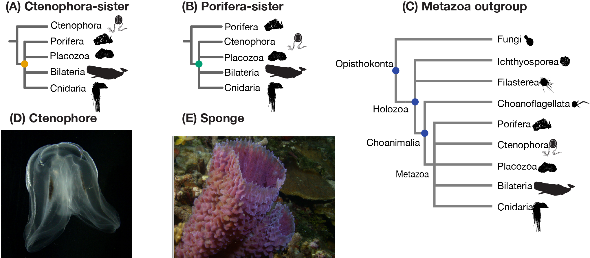
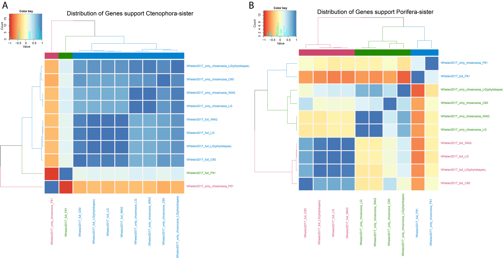
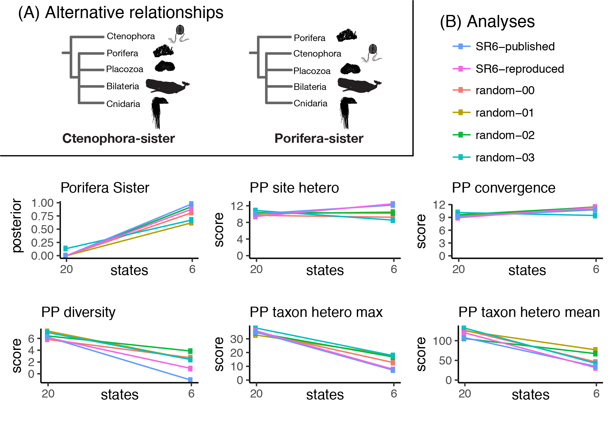
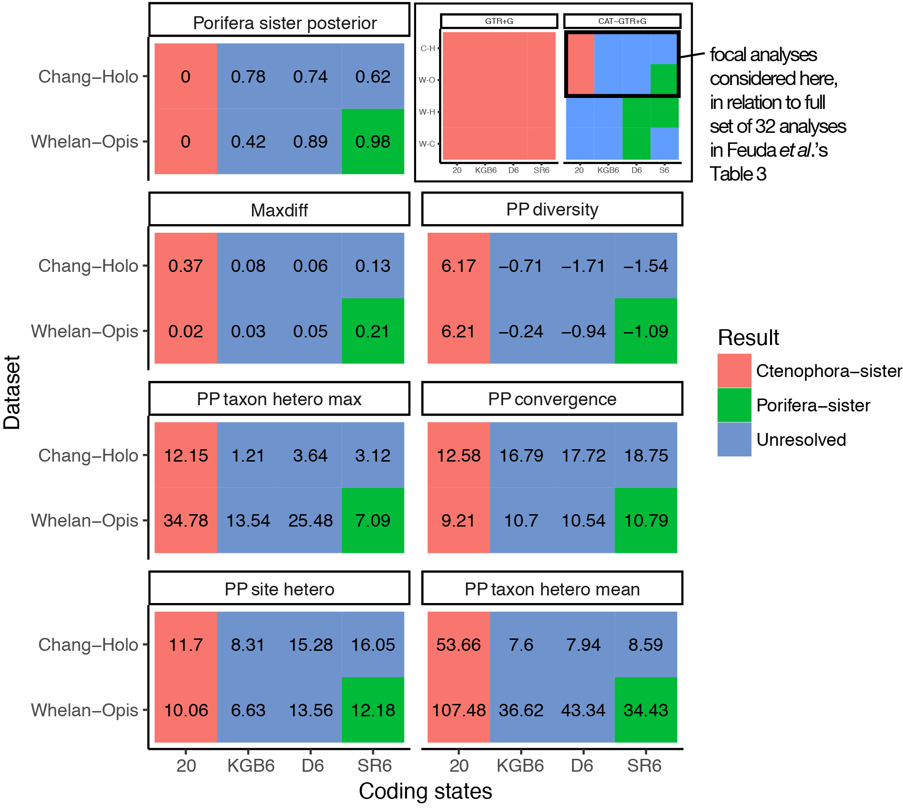

```{r setup, include=FALSE}
knitr::opts_chunk$set(
	message = FALSE,
	warning = FALSE,
	echo=FALSE,
	dpi=300,
	cache=FALSE
	)
```


```{r load_data}

	# Load data and analysis results generated by
	# manuscript_kernel.R
	load("manuscript.RData")
```


```{r preliminaries}
	library( tidyverse )
	library( magrittr )
	library( viridis )
	library( knitr )
	library( gridExtra )
	library( ggpubr )
	library( grid )
	library( gtable )
	theme_set(theme_pubr())
	source( "functions.R" )

	# A colorblind friendly palette from http://www.cookbook-r.com/Graphs/Colors_(ggplot2)/#a-colorblind-friendly-palette:
	cbPalette <- c("#999999", "#E69F00", "#56B4E9", "#009E73", "#F0E442", "#0072B2", "#D55E00", "#CC79A7")

	result_colors = c( cbPalette[2], cbPalette[4], cbPalette[1] )
	names( result_colors ) = c( "Ctenophora-sister", "Porifera-sister", "Unresolved" )

```

# Rooting the animal tree of life

Yuanning Li^1,3^, Xingxing Shen^3^, Benjamin Evans^2^, Antonis Rokas^3^, and Casey W. Dunn^1^*

^1^Department of Ecology and Evolutionary Biology, Yale University

^2^Yale Center for Research Computing, Yale University

^3^Department of Biological Science, Vanderbilt University

\* Corresponding author, casey.dunn@yale.edu


## Summary (ideally no more than 200 words, currently 251 words)
XX This summary paragraph should be structured as follows: 2-3 sentences of basic-level introduction to the field; a brief account of the background and rationale of the work; a statement of the main conclusions (introduced by the phrase 'Here we show' or its equivalent); and finally, 2-3 sentences putting the main findings into general context so it is clear how the results described in the paper have moved the field forwards

Phylogenomic studies based on hundreds to thousands of genes have greatly improved our understanding of evolutionary relationships in the animal tree of life. However, considerable debate still remains regarding the deepest split in the animal tree of life, with Ctenophora-sister and Porifera-sister emerging as the two primary alternative hypotheses. This has been one of the most difficult to resolve nodes in animal tree of life, and has major implications for our understanding of the earliest events in animal evolution. Here we systematically explore this question by synthesizing data and results from all previous phylogenomic analyses and perform new analyses with these data to characterize the differences between matrices under consistent conditions. Our reanalyses are generally consistent with previous results. We next quantify the support of phylogenetic signal and conduct sensitive analyses in several representative data matrices. We found that the Porifera-sister can only be recovered with several combined factors, including inclusive of a more simplistic evolutionary model, an unrealistic large number of substitution categories, more closely related outgroups and certain gene samplings, whereas Ctenophora-sister is supported in most other conditions. We also show that recoding amino acid data into reduced state space, another approach that has been suggested to address variation in amino acid frequencies, is problematic. Thus, our results provide a comprehensive overview of the current understanding of the first diverging animal branch and why different studies yield different answers. This synthesis provides an integrative overview of the challenge and provides direction for future studies to address difficult phylogenetic problems.


## Main (The typical length of an article with 3-4 modest display items (figures and tables) is 2000-2500 words (summary paragraph plus body text), currently is ~4500 words...)
Phylogenomic analyses with genome-scale data have the potential to revolutionize our understanding of the tree of life. However, over the past decade, there has been considerable debate about the position of the root of the animal phylogeny, with Ctenophora-sister (comb jelly) and Porifera-sister (sponges) (Fig. 1) emerging as the two primary hypotheses. Historically, there was little debate about the root of the animal tree of life and Porifera-sister was widely accepted though rarely tested. By contrast, there has long been uncertainty about the relationship of Ctenophora to other animals [@Wallberg:2004ws]. An understanding of the placement of these lineages is critical for scientists to reconstruct events that occurred  early in animal evolution, especially for the evolution of complex structures such as cell types, nervous systems, and developmental patterns. However, a wide consensus of animal origin has not been reached despite multiple efforts.

The first phylogenomic study to include ctenophores [@Dunn:2008ky] suggested a new hypothesis, now referred to as Ctenophora-sister, that ctenophores are our most distant animal relative. Since then many more studies have been published, some supporting Ctenophora-sister, some Porifera-sister, and some neither (Table 1). It has become clear that this is a very difficult phylogenetic challenge. As the problem has become better characterized, it has become an interesting test-case to phylogenetic biologists beyond those concerned with this particular biological problem. Work has been hindered, though, because it has been difficult to directly compare results across studies and synthesize findings to understand the broader patterns of support. Here we synthesize data and results from phylogenomic analyses that tested Ctenophora-sister and Porifera-sister. We reanalyze these data using standardized methods, and perform new analyses to characterize differences between studies. This provides an integrative overview of the challenges posed by this question and provides direction for future studies. We also hope that the work we have conducted here, including consolidating all the datasets in one place with consistent formats and species names, will enhance the technical value of this interesting question to methods-focused investigators that look to develop methods to address difficult phylogenetic problems.


**Fig. XXFigure_overview.** (A) The Ctenophora-sister hypothesis posits that there is a clade (designated by the orange node) that includes all animals except Ctenophora, and that Ctenophora is sister to this clade. (B) The Porifera-sister hypothesis posits that there is a clade (designated by the green node) that includes all animals except Porifera, and that Porifera is sister to this clade. Testing these hypotheses requires evaluating the support for each of these alternative nodes. (C) The animals and their outgroup choice, showing the three progressively more inclusive clades Choanimalia, Holozoa, and Opisthokonta (designated by the blue node). (D) A ctenophore. (E) A sponge.


## Variation across studies

### Models of molecular evolution

Models of molecular evolution have several components that each consider different aspects of the evolutionary process. The models that have been used to model protein evolution in studies of the deep phylogeny have largely differed according to three components: the exchangeability matrix $E$ , the rate of evolution, and the amino acid equilibrium frequencies $\Pi$. The exchangeability matrix $E$ describes the rate at which one amino acid changes to another (*e.g.* Poisson/F81, WAG or LG, and GTR). The rate of exchange can be further scaled, for example with a Gamma parameter that accommodates rate variation across sites. Heterogeneous equilibrium approaches include CAT [@Lartillot:2004dq], which is implemented in the software PhyloBayes and has been widely applied to questions of deep animal phylogeny. Models of molecular evolution are assembled by selecting different options for all these different components. The models that are applied in practice are heavily influenced by computational costs, as well as convention. For example, on the questions considered here, CAT site-heterogeneous models of equilibrium frequency have only been used in combination with Poisson and GTR exchangeability matrices. LG and WAG exchangeability matrices have only been used with site homogeneous estimates of equilibrium frequency. This is further confused by the abbreviations that are used for models. Papers often discuss CAT and WAG models as if they are exclusive, but these particular terms apply to non-exclusive model components– CAT refers to equilibrium frequency variation across sites and WAG a particular exchangeability matrix. In this literature, CAT is generally shorthand for Poisson+CAT and WAG is shorthand for WAG+homogeneous equilibrium frequency estimation. To avoid confusion on this point, we always specify the exchangeability matrix first, followed by modifiers that describe the accommodation of heterogeneity in equilibrium frequencies (e.g., CAT). Moreover, the Gamma-rate heterogeneity is used in almost every analysis conducted here. If there are no modifiers, then it is implied that site homogeneous models are used. A detailed description of each component is provided in Supplementary Results.

### Gene and taxa sampling

High-throughput sequencing allows investigators interested in the phylogeny of early diverging animals to assemble matrices with hundreds or thousands of genes (Table 1). Surprisingly, gene overlap between studies has rarely been assessed. Though there are many genes with homologs present in most known animal genomes (*e.g.*, animal BUSCO genes [@waterhouse2017busco]), studies of animal phylogeny often relied on a wide variety of different bioinformatic approaches to identifying and selecting genes for their matrices. These take different approaches to sequence comparison, filtering, and orthology assessment, and gene selection can be impacted by which datasets are considered (see supplementary text for more details). As a result, the genes selected for analysis can vary widely between studies.

Outgroup selection (the non-animal taxa used to root the animal tree) can affect the phylogenetic inference of animal evolution (Fig. 1C). Several studies have progressively removed more distantly related outgroup taxa to test the effect of outgroup selection to ingroup topology [ @ryan2013genome; @pisani2015genomic]. Three progressively more inclusive clades have often been investigated: Choanomalia (animals plus most closely related Choanoflagellata), Holoza (Choanimalia plus more distantly related holozoans) and Opisthokonta (Holozoa + Fungi). It has been suggested the inclusion of more distant related (e.g. Fungi) outgroup taxa tend to recover Ctenophora-sister, whereas increasing support of Porifera-sister often recovered when more closely related outgroup taxa were used with site-heterogeneous Poisson-CAT models [@pisani2015genomic]. In contrast of outgroup selection, sensitivity to ingroup sampling has received less attention.

### Data-recoding

Compositional heterogeneity (clade-specific and site-specific differences in amino acid frequencies) have been a concern in the study of phylogenetics, and has been of particular concern for the deep animal phylogeny [@philippe2011resolving]. Variation in evolutionary rates across taxa can lead to compositional heterogeneity that may lead to long branch attraction of sponges or ctenophores [@King:2017ie]. Feuda *et al*. 2017 [@feuda2017improved] has proposed to use data-recoding method to reduce compositional heterogeneity in matrices. By discarding information on which specific amino acid is found at each site in each species and instead focusing on which groups those amino acids belong to, they sought to reduce the impact of differences between species in which particular amino acids within those groups are most frequent. However, how the recoding methods impact phylogenetic inference has not been well explored. Moreover, a recent simulation study has suggested that non-recoding approaches significantly outperformed recoding strategies [@hernandez2019six].


## Overview of published analyses
Here, we synthesize data and results from previous phylogenomic analyses that tested Ctenophora-sister and Porifera-sister from 14 studies (Table 1). These matrices include all relevant studies published before 2020 for which we could obtain data matrices with gene partitions that described boundaries between genes.


### Matrix taxon composition

Taxa sampling plays a critical role in phylogenetic inference, especially for the taxa whose phylogenetic position is poorly understood. However, several data matrices have relatively skewed taxon sampling, with more than 50% taxa sampled in Bilateria compared to other major animal lineages (Extended Data Fig. 1). These skewed data matrices include two studies constructed from ESTs (Dunn2008 [@Dunn:2008ky] and Hejnol2009 [@hejnol2009assessing]) and one study from whole-genome data (Borrowiec2015 [@borowiec2015extracting]). Importantly, several earlier studies before 2015 only include less than five ctenophore species (Extended Data Fig. 1). The rest data matrices have relatively balanced taxon composition, although the total number of sampled taxon varies. In general, increasing taxon sampling is broadly accepted to improve phylogenetic inference and aid in the placement of the earliest diverging animal lineage. Thus, it should be noted that Whelan2017 [@whelan2017ctenophore] (has the most Ctenophore taxa) and Simion2017 [@simion2017large] (contains the most taxon sampling) have much broader taxon sampling than other matrices.


```{r figure_taxon_rectangles, fig.height = 18, fig.width = 20 }

no_subsets = unlist(lapply(sequence_matrices, function(x) !grepl("only|_D", x@matrix_name)))

taxon_rectangles = lapply(
	sequence_matrices[no_subsets],
	function ( sequence_matrix ){
		clade_rects(sequence_matrix)
	}
) %>%
bind_rows()

taxon_rectangles$matrix[taxon_rectangles$matrix == "Simion2017_subsampled"] <- "Simion2017"
taxon_rectangles$matrix[taxon_rectangles$matrix == "Hejnol2009_subsampled"] <- "Hejnol2009"

clade_colors = c("#e31a1c","#a6cee3","#1f78b4","#b2df8a","#33a02c","#fb9a99","#a6cee3","#fdbf6f","#cab2d6", "#ff7f00")
names( clade_colors ) = clades

ggplot(data=taxon_rectangles) +
	scale_x_continuous(name="Gene sampling") +
	scale_y_continuous(name="Taxa sampling") +
	geom_rect( mapping=aes(xmin=xmin, xmax=xmax, ymin=ymin, ymax=ymax, fill=clade )) +
	#scale_fill_manual(guide = guide_legend(reverse=TRUE))+
 scale_fill_manual(values = clade_colors, guide = guide_legend(reverse=TRUE))+
	#scale_fill_discrete(guide = guide_legend(reverse=TRUE, legend = "bottom right")) +
	facet_wrap( ~ matrix )

```

**Fig. XXtaxon_rectangles.** Matrix taxa and gene sampling. Each of the primary matrices considered here, color coded by taxon sampling. Horizontal size is proportional to the number of genes sampled, vertical size to the number of taxa sampled.


### Matrix gene sampling are largely different across studies

We first used the Metazoa BUSCO genes [@waterhouse2017busco] to evaluate gene composition from all data matrices and the result is unexpected (Extended Data Fig. 2A). The animal BUSCO dataset contains 978 single-copy orthologs (identified from 64 animal genomes) that are most likely shared by most animal genomes, and are commonly used to assess the completeness of assemblies from genomic data [@waterhouse2017busco]. The BUSCO genes also are frequently used as markers in many large-scale phylogenomic studies (e.g., yeasts [@shen2018tempo], spiders [@fernandez2018phylogenomics]). Thus, it is reasonable to expect that these conserved genes should present at a higher percentage than non-BUSCO genes in most matrices. However, we found that gene partitions from all matrices comprised less than 50% of BUSCO genes, even with several data matrices contain less than 20 percent (Extended Data Fig. 2B). Moreover, we identified number of ribosomal RNA genes in each data matrix (Extended Data Fig. 2C) and found that Philippe2009, Nosenko2013_ribo_14615 and Chang2015 matrices possessed much higher content of ribosomal genes than other matrices (Extended Data Fig. 2D). We also annotated each gene partition against SwissProt [@boeckmann2003swiss] and Gene Ontology databases, and results are shown in Supplementary Table 1.
Moreover, our network analyses show that surprisingly little overlap of gene samplings across all the data matrices from different studies (Fig. 2). Thus, these results strongly suggested that gene sampling largely varies across studies, indicating that different regions of the genomes are sampled with little overlap among different data matrices.

### Support for Porifera-sister and Ctenophora-sister

```{r figure_support_analyses_published}
aanalyses_published=read_tsv("../data_processed/tables/previously_published_analyses.tsv")
analyses_published_filter = dplyr::filter(analyses_published, !grepl('Recoding', model_combined))
x1 = factor(analyses_published_filter$model_combined, levels=c("WAG", "LG", "GTR", "data partitioning", "Recoding + GTR", "Recoding + GTR + CAT", "Poisson + CAT", "GTR + CAT"))
p1 = analyses_published_filter %>%
	ggplot( aes(x=x1, y=clade, col=final, shape=inference) ) +
		geom_jitter( width = 0.20, height = 0.20, alpha=0.7, size=2 ) +
		scale_colour_manual(values = result_colors) +
		theme_classic() + theme(axis.text.x = element_text(angle=45, hjust=1))+
   xlab("Model complexity") + ylab("Clade")

analyses_new=analyses_new %>%
mutate(model=recode(model,
                    `GTR20`="GTR",
                    `CAT+F81`="Poisson+CAT"))

x2 = factor(analyses_new$model, levels=c("WAG", "GTR", "Poisson+C60", "WAG+C60", "LG+C60", "Poisson+CAT"))
p2 = analyses_new %>%
	ggplot( aes(x=x2, y=clade, col=result, shape=inference) ) +
		geom_jitter( width = 0.20, height = 0.20, alpha=0.7, size=2 ) +
		scale_colour_manual(values = result_colors) +
		theme_classic() + theme(axis.text.x = element_text(angle=45, hjust=1))+
       xlab("Model complexity") + ylab("Clade")

ggarrange(p1, p2, ncol = 2, labels = c("A", "B"), common.legend = TRUE, legend = "right")

```
**Fig. XXfigure_support_analyses.**  A summary of phylogenomic results from the previous studies and reanalyses conducted in this study. (A) A total of `r nrow(analyses_published_filter)` analyses were transcribed from the literature (Table XX). (B) A total of `r nrow(analyses_new)` new phylogenomic analyses were conducted in this study (Supplementary Table XX).

Here we summarized all the `r nrow(analyses_published)` previous phylogenetic analyses from `r length(unique(analyses_published$manuscript))` studies (Fig. 3A and Supplementary Table 2). Among these studies, the main conclusions of five studies strongly in favor of Porifera-sister and 10 in support of Ctenophora-sister (Table 1). Moreover, three studies are secondary studies without any new data matrices. Interestingly, we found that all analyses strongly support of Ctenophora-sister once site-homogeneous models were used, no matter what outgroup choice, phylogenetic inference and whether data-recoding are used. The support for Porifera-sister increases with the exclusion of more distantly related outgroups and with the use of site-heterogeneious CAT (Poisson+CAT or GTR+CAT) models in several matrices, including Philippe2009, Ryan2013_est and Whelan2015. It should be noted that many BI analyses with CAT model are not well resolved (either not reach convergence or do not provide significant support for the key node of animal evolution) mainly due to computational limits of CAT models employed in PhyloBayes. The strong support of Porifera-sister can only be recovered from analyses using Poisson+CAT and recoding methods with GTR+CAT models in several matrices. Although GTR+CAT model generally has better model adequacy than Poisson+CAT or site-homogeneous models from previous studies[@pisani2015genomic; @feuda2017improved], Porifera-sister is not always supported since several analyses strongly in favor Ctenophora-sister even with only choanofalgellates are used as outgroups (Fig. 3A). Thus, our summary of previous phylogenetic analyses strongly indicated that the trend of the support of Porifera-sister is generally increasing with the use of more complex CAT models and more closely related outgroups in several representative matrices, whereas Ctenophora-sister is supported in most other conditions.


## New analyses of published matrices are largely consistent with previous

One of the challenges of interpreting support for the placement of the animal root is that different programs, software versions, and settings have been used across studies, and phylogenetic analysis decisions have been approached in very different ways. Thus, it easily causes confusions with the increase number of studies.  Here we first reanalyze the primary matrices from each study under consistent conditions with IQtree [@nguyen2014iq] under a panel of evolutionary models. We selected this tool because it has greater model flexibility, computational time and accuracy than other tools in maximum likelihood (ML) framework [@zhou2017evaluating] (Fig. 3B; Supplementary Table 3). Importantly, we also include a CAT-like, site-heterogeneous C10 -C60 (C60) models [@si2008empirical] that are implemented in both ML framework in our analyses and it is interesting to compare results between C60 model to CAT models since it has never been used in any matrices analyzed here.

Here we reanalyzed 17 matrices from 12 studies that are used as main conclusions from their original paper (Table 1). We also progressively trimmed each data matrix with three level of outgroup choice if applicable (Fig 1C). We first tested a variety of models for each matrix and compared the relative fit of site-homogeneous and site-heterogeneous C60 models using ModelFinder [@kalyaanamoorthy2017modelfinder] in IQtree (except only LG+C60 models are used in 3 large matrices). We found in all cases, WAG/LG+C60 models fit these matrices better than the site-homogeneous models under BIC criteria and we then inferred support under the best-fit model from IQtree (Extended Data Table 1). We then analyzed every matrix under a panel of standard site-heterogeneous and site-homogeneous models, including WAG, GTR and Poisson+C60. Moreover, we also used the best-fit model identified above with the removal of all distantly related outgroups and only include Choanoflagellata as outgroups. Interestingly, with the exception of Moroz2014_3d and all Nosenko2013 matrices that supports neither Porifera-sister or Ctenophora-sister, all analysis conducted herein in IQtree strongly supported the ctenophore-sister hypothesis, even with CAT-like, site-heterogeneous C60 models (Poisson+C60 and WAG/LG+C60) with the most closely related outgroups (Fig. 3B; Supplementary Table 3).

Site heterogeneity in equilibrium frequency has been a major concern in tests of Ctenophora-sister and Porifera-sister. This has been addressed with CAT models. IQtree provides a new family of C60 models that also address site heterogeneity. Given the extensive computational cost and concerns about overparameterization of CAT models [@whelan2016let], we compared C60 results to CAT results for a subset of matrices to see if they give consistent results. This would be of technical interest because it would reduce the cost of accommodating compositional heterogeneity in future analyses. It should be noted that most Phylobayes runs were converged, although several large matrices have not reached convergence after at least a month's computational time.

Interestingly, we found strong supports for both hypotheses when using Poisson-CAT model in analyzed Choanimalia matrices. Similar to ML analyses, we found no strong support for either hypothesis in Moroz2013_3d and Nosenko2013 matrices. Consistent with previous study [@Philippe:2009hh; @pisani2015genomic], we recovered support of Porifera-sister in matrices of Philippe2009, Ryan2013_est and Whelan2015. Interestingly, we also found a strong support of Porifera-sister in two Whelan2017 matrices[@whelan2017ctenophore] and a weaker support of subsampled matrix of Simion2017 [@simion2017large]. The Ctenophora-sister were strongly supported in all other matrices. For the matrices have conflicted results between Poisson-CAT and  IQtree, we further ran Poisson+CAT models with inclusion of more distantly related outgroups to evaluate how outgroup choice may affect phylogenetic inference under CAT model. We found a weak support of Porifera-sister in all Holozoa matrices and strong support of Ctenophora-sister in all analyzed Opisthokonta matrices. These results suggest that Porifera-sister can only be recovered in certain gene sampling in several representative matrices with the exclusive of more distantly related outgroups when analyzed using Poisson-CAT. Thus, our results from reanalyses are largely similar to previous studies and indicate that both model choice and outgroup sampling play a major role in incongruent results of animal origin in several representative data matrices.

### Drastic changes of phylogenetic signal between site- homogeneous and heterogeneous models

The distribution of phylogenetic signal has never been quantified in site-heterogeneous models and compared with site-homogeneous models. To further explore the effect of model selection and outgroup choices in animal origin, we next quantify the support of phylogenetic signal over two alternative hypotheses (T1: Ctenophora-sister (Fig. 1A); T2: Porifera-sister (Fig. 1B)) to three representative data matrices with different outgroup choice and models in both ML and BI framework (Fig. 5). By calculating gene-wise log-likelihood scores between T1 and T2 for every gene ($\Delta$GLS) or site ($\Delta$SLS) in each matrix, we found that Ctenophora-sister had the higher proportions of supporting genes in every analysis when using site-homogeneous models (LG or WAG in both IQtree or PhyloBayes). Moreover, the outgroup choice has little impact on the distribution of the support of phylogenetic signal in sifte-homogeneous models. This finding is largely consistent with the results from past study that majority of phylogenetic signal is strongly favored in Ctenophora-sister hypothesis with site-homogeneous models in other data matrices [@shen2017contentious].  

In contrast, the phylogenetic signal of site-heterogenous models changed dramatically compared to the site-homogenous models. Although Ctenophora-sister also had the higher proportions of supporting genes with C60 models, we found that the phylogenetic signal decreases in many genes using C60 models compared to site-homogeneous models, especially in matrices from Ryan2013_est that nearly 30% of genes changed from strong to week signal (\Delta$lnL<2) (Fig. 5B; Supplementary Table 4). In contrast to the C60 models, the phylogenetic signal largely increased in Poisson-CAT models and more importantly, the outgroup choice has a major effect of the distribution of phylogenetic signal (Figs. 5A, C). We found that support for Ctenophora-sister largely decreases and Porifera-sister increases (~ 20% of sampled gene partitions) when exclusive of more distantly related outgroups with the Poisson-CAT models (Supplementary Table 4). The results here are further corroborated by our phylogenomic analyses in BI, which the support of Porifera-sister generally increases in Holozoa and Choanimalia matrices.


### Increase CAT categories lead to different topologies
The major difference between site-heterogeneous CAT and C60 models are the number of substitutional categories that are used in different data matrices. CAT models employ a Dirichlet process prior to infer number of substitutional categories or profiles with different nucleotide or amino acid frequencies to account for substitutional heterogeneity across a phylogenetic data matrix. Here, we reported the number of categories inferred from CAT model for each PhyloBayes analysis (Table XX). The number of categories is considerable larger than 60 categories used in C60 models, and in most cases even larger than the gene partitions within each data matrix (Table xx). Although the true number of substitutional categories in empirical data matrices is impossible to determine with current phylogenetic tools, we found that the amino frequencies of several categories inferred by C60 model are close to zero from IQtree results, potentially indicating that the C60 models might be already overfitting to most matrices. These results are consistent with the findings that CAT model often overestimate the true number of substitutional categories, especially for large data matrix from simulation analyses [@whelan2016let].

We next explore how the increase of number of categories may affect the phylogenetic inference related to the animal phylogeny with a panel of different substitutional categories in the representative data matrices (Fig. XX). Surprisingly, we found Poisson+nCAT60 showed exact same topology as Poisson+C60 or WAG+C60 with strong support of Ctenophora-sister, suggesting that the different phylogenetic analysis software (IQtree and PhyloBayes) and phylogenetic inference (ML and BI) has limited impact on phylogenetic inference to these matrices with similar evolutioanry models. Importantly, our results gave decreased support for Ctenophora-sister and increased support of Porifera-sister with the increase of number of substitutional categories (Fig. XX). More importantly, we are able to identify the transition of topology between the two alternative hypotheses in these three matrices. For example, the major transition occurred at 60 – 120 categories, and the support for Ctenophora-sister disappears after 120 categories in the Whelan2017_strict matrix. Interestingly, the results of our sensitive analyses further corroborated by the recent simulation study that the tendency of overestimate the true number of categories of Poisson-CAT or GTR-CAT model can potentially lead to a less accurate tree than the site-homogeneous models [@whelan2016let].

The GTR-CAT model often has a better model-fitting than Poisson-CAT model in previous analyses, and it is also suggested a better performance than Poisson-CAT model. Due to computational efficiency, we only ran GTR-CAT and GTR-nCAT60 models in the representative data matrices with the most closely related choanofalgellates as outgroups. Interestingly, we found both Whelan2017 and Philippe matrices shifted from Porifera-sister with Poisson-CAT model to Ctenophora-sister using GTR-CAT model. Moreover, we also found all results strongly supported the Ctenophora-sister with GTR-nCAT60 models. Thus, these results suggested that the Porifera-sister can only be recovered with several combined factors, including inclusive of a more simplistic evolutionary model, an unrealistic large number of substitution categories, more closely related outgroups and certain gene samplings, whereas Ctenophora-sister is supported in most other conditions.

``` {r sensitive, fig.width=8, fig.height=8}
sensitive = read_tsv("../data_processed/tables/sensitive.tsv")
Philippe2009 = sensitive %>% filter(Matrix == "Philippe2009_only_choanozoa" )
Philippe2009$Model = factor(Philippe2009$Model, levels=c("Poisson_CAT60" , "Poisson_CAT90","Poisson_CAT120","Poisson_CAT150","Poisson_CAT180"))
p1<-ggplot(Philippe2009, aes(Model))+
  geom_line(aes(y = `Ctenophora-sister`, colour = "Ctenophora-sister", group=1), color=("#E69F00")) + geom_point(aes(y = `Ctenophora-sister` ), color=("#E69F00"))+
  geom_line(aes(y = `Porifera-sister`, colour = "Porifera-sister",group=2), color=("#009E73")) + geom_point(aes(y = `Porifera-sister` ), color=("#009E73"))+
  scale_fill_manual(values=c("#E69F00", "#ebd196")) +
  theme_classic() +
  theme(axis.text.x = element_text(angle=45, hjust=1)) +
  labs(x ="Number of CAT substitutional categories", y = "Support") + ggtitle("Philippe2009_Choanozoa")

Philippe2009 = sensitive %>% filter(Matrix == "Philippe2009_only_Holozoa")
Philippe2009$Model = factor(Philippe2009$Model, levels=c("Poisson_CAT360", "Poisson_CAT400","Poisson_CAT440","Poisson_CAT480"))
p2<-ggplot(Philippe2009, aes(Model))+
  geom_line(aes(y = `Ctenophora-sister`, colour = "Ctenophora-sister", group=1), color=("#E69F00")) + geom_point(aes(y = `Ctenophora-sister` ), color=("#E69F00"))+
  geom_line(aes(y = `Porifera-sister`, colour = "Porifera-sister",group=2), color=("#009E73")) + geom_point(aes(y = `Porifera-sister` ), color=("#009E73"))+
  scale_fill_manual(values=c("#E69F00", "#ebd196")) +
  theme_classic() +
  theme(axis.text.x = element_text(angle=45, hjust=1)) +
  labs(x ="Number of CAT substitutional categories", y = "Support") + ggtitle("Philippe2009_Holozoa")

Whelan2017_full_only_choanozoa = sensitive %>% filter(Matrix == "Whelan2017_full_only_choanozoa")
Whelan2017_full_only_choanozoa$Model = factor(Whelan2017_full_only_choanozoa$Model, levels=c("Poisson_CAT60" , "Poisson_CAT340","Poisson_CAT380","Poisson_CAT420","Poisson_CAT460"))
p3<-ggplot(Whelan2017_full_only_choanozoa, aes(Model))+
  geom_line(aes(y = `Ctenophora-sister`, colour = "Ctenophora-sister", group=1), color=("#E69F00")) + geom_point(aes(y = `Ctenophora-sister` ), color=("#E69F00"))+
  geom_line(aes(y = `Porifera-sister`, colour = "Porifera-sister",group=1), color=("#009E73")) + geom_point(aes(y = `Porifera-sister` ), color=("#009E73"))+
  scale_fill_manual(values=c("#E69F00", "#ebd196")) +
  theme_classic() +
  theme(axis.text.x = element_text(angle=45, hjust=1)) +
  labs(x ="Number of CAT substitutional categories", y = "Support") + ggtitle("Whelan2017_full_Choanozoa")

Whelan2017_strict = sensitive %>% filter(Matrix == "Whelan2017_strict" )
Whelan2017_strict$Model = factor(Whelan2017_strict$Model, levels=c("Poisson_CAT60" , "Poisson_CAT70","Poisson_CAT80","Poisson_CAT90","Poisson_CAT100","Poisson_CAT110", "Poisson_CAT120","Poisson_CAT150","Poisson_CAT180", "Poisson_CAT360"))
p4<-ggplot(Whelan2017_strict, aes(Model))+
  geom_line(aes(y = `Ctenophora-sister`, colour = "Ctenophora-sister", group=1), color=("#E69F00")) + geom_point(aes(y = `Ctenophora-sister` ), color=("#E69F00"))+
  geom_line(aes(y = `Porifera-sister`, colour = "Porifera-sister",group=1), color=("#009E73")) + geom_point(aes(y = `Porifera-sister` ), color=("#009E73"))+
  scale_fill_manual(values=c("#E69F00", "#ebd196")) +
  theme_classic() +
  theme(axis.text.x = element_text(angle=45, hjust=1)) +
  labs(x ="Number of CAT substitutional categories", y = "Support")+ ggtitle("Whelan2017_strict")

ggarrange(ggarrange(p1, p2, ncol = 2, labels = c("A", "B")),nrow = 3,
          p3,p4, labels = c("C", "D"))
```
**Fig. XXsensitive.**  

### Bias of data-recoding
There is growing interest in data-recoding and previous study [@feuda2017improved] hoped that data-recoding would reduce potential artifacts due to differences across species in amino acid frequencies. They report that posterior predictive (PP) analyses [@Bollback:2002to] indicate 6-state recoded analyses have better model adequacy than 20-state amino acid analyses, and "Porifera-sister was favored under all recoding strategies" in Whelan2015_D20 and Chang2015 data matrices. Here we focus on two aspects of Feuda *et al.* First, we found that many of their recoded analyses are actually unresolved (*i.e.*, without strong support for either Porifera-sister or Ctenophora-sister), and that the analyses with the best posterior predictive scores do not provide strong support for Porifera-sister (Extended Data Fig. 3B). Second, we created four new random recoding schemes by shuffling the amino acids in the SR-6 scheme (see methods). When we applied each of these randomized codes to the Whelan matrix and analyzed them under the CAT-GTR+G model with PhyloBayes-MPI [@Lartillot:2013fg], we observed similar results as for the empirical SR-6 recoding. Like SR-6 recoding, random recoding increases support for Porifera-sister and improves the apparent adequacy of models to explain heterogeneity of states across taxa (PP taxon hetero mean and max, Extended Data Fig. 5). Thus, our analyses show the impact of recoding is largely due to discarding information, not accommodating variation in amino acid composition. These findings indicate that it is premature to accept Porifera-sister and reject Ctenophora-sister using data-recoding methods and recoding can be a problematic method for addressing compositional variation (see more detailed discussion in supplementary text).  


## The current state of understanding and future direction
Resolving the root position of animal phylogeny that diverged ~ 650 million years ago has proven particularly difficult, even with large genome-scale phylogenomic data matrices. By synthesizing all past phylogenomic studies and perform new analyses to characterize difference between studies, we found the support of Porifera-sister can only be recovered by site-heterogeneous CAT models with the most closely related outgroups, and Ctenophora-sister in all other cases. Four factors contribute significantly to the previous incongruent results based on our analyses. First, the overlap of gene sampling and matrix is extremely low across different studies, leading to the difficult of directly compare the results across different studies. Second, the distribution of phylogenetic signal are largely varied between site-homogeneous and site-heterogeneous models. More importantly, site-heterogeneous models are also more sensitive to outgroup choice than site-homogeneous models, leading to different results even with the same data matrix with different outgroup choice. Third, we found that increase of number of substitutional categories coupled with a more simplistic model can change the root position of animal phylogeny. Last, we demonstrated that the support of Porifera-sister by data-recoding methods is potentially resulted by data reduction, not accommodation of compositional heterogeneity across species. Thus, the recovery of Porifera-sister needs more constraints than Ctenophora-sister.

Many key positions of animal phylogeny can be reconstructed by increasing genome-scale data within a phylogenomic framework, although new challenges have also arised. Overcoming the challenges to inferring the earliest diverging animal lineage is particular difficult and here we discuss the several aspects that will help to improve our understanding of animal evolution. First, a broader sampling of high-quality sponge and ctenophore genomes are needed to shorten the long branch since they are among the longest branches in the animal phylogeny (currently only 2 ctenophore and 3 sponge genomes are available). Second, accurate reconstruction of orthologs and a consensus analytical strategy should be formalized with investigators to improve communications and reproducibility of phylogenetic workflow [@guang2016integrated]. Last, we also hope that the work we have conducted here, including consolidating all the datasets in one place with consistent formats and species names, will enhance the technical value of this interesting question to methods-focused investigators that look to develop and evaluate methods or evolutionary models to address this difficult phylogenetic problem. More importantly, we also hope all investigators critically evaluate the competing hypotheses without bias instead of showing preferences to one hypothesis over as a priori due to historical reasons or previous work. Finally, other sources of evidence may also provide important insight to animal origin, including morphological characters [@mah2014choanoflagellate; @nielsen2019early] and fossil records [@zhao2019cambrian]. We hope the future breakthroughs that will allow us to move the field forward and a consensus viewpoint of early animal evolution will be reached in the coming years.

## Methods

All tree files, intermidiate results and scripts/commands associated with this study are available at https://github.com/caseywdunn/animal_root, doi will be provided upon publicaton.

### Data selection and wrangling

We retrieved matrices from each publication (Table 1), storing the raw data in this manuscript's version control repository. We manually made some formatting changes to make the batch processing of the matrices work well, *e.g.* standardizing the format of Nexus CHARSET blocks. All changes made are tracked with git.

### Matrix comparison and annotation

#### Taxon name reconciliation

We programmatically queried the NCBI Taxonomy database to standardize names of samples in each matrix. We also used a table where manual entries were needed (Supplementary Table 5, manual_taxonomy_map.tsv), e.g. authors of the original matrix indicate species name in original manuscript. For a table summarizing all samples and their new or lengthened names, see Supplementary Table 6 (taxon_table.tsv).

#### Sequence comparisons

Using the original partition files for each matrix, we separated each sequence for each taxon from each partition. Because many of the matrices had been processed by the original authors to remove columns that are poorly sampled or highly variable, these matrix-derived sequences can have deletions relative to the actual gene sequences.

We used DIAMOND v0.9.26 [@Buchfink:2014] to compare each sequence to all others using default diamond Blastp parameters. We further filtered DIAMOND results such that we retained hits for 90% of partitions (pident > 50.0, eValue < 1e-5, no self vs self). We ran BUSCO with default parameters for all sequences against the provided Metazoa gene set. We also ran a BLAST+ v2.8.1 [@Camacho:2009] blastp search against the SwissProt [@boeckmann:2003swiss] database, filtering results such that we retain at least one hit for ~97% of partitions (pident > 50.0, eValue < 1e-15).

#### Partition network

We used the sequence similarity comparisons described above to compare partitions.

We constructed a network with Python and NetworkX v2.2 [@Hagberg:2008] where each node is a partition and each edge represents a DIAMOND sequence-to-sequence match between sequences in the partitions. We extracted each connected component from this network. We further split these components if the the most connected node (i.e. most edges) had two times more the standard deviation from the mean number of edges in the component it is a member of and if removing that node splits the component into two or more components. We then decorated every node in the partition network with the most often found SwissProt BLAST+ result and BUSCO results to see which components contain which classes and families of genes. See Supplementary Table 7 [XX partition_network_summary table] for a summary tally of each part of the comparison.


### Phylogenetic analyses

#### Phylogenetic analyses in IQtree
To investigate the phylogenetic hypotheses and distribution of phylogenetic signal in studies aiming to find the root position of animal phylogeny, we considered 16 data matrices from all phylogenomic studies that were constructed from EST, transcriptomic, or genomic data (Table 1). Because different choices of substitution models could largely influence phylogenetic inference of the placement of the root position of animal phylogeny (e.g. site-heterogeneous vs. site-homogeneous models), we first investigated model-fit from each matrix using ModelFinder in IQtree v1.6.7, including site-heterogenous C10 to C60 profile mixture models (C60 models) as variants of the CAT models in ML framework (C10-C60 model were included for model comparison via -madd option). We included models that are commonly used in previous analyses, including site-homogeneous poisson, WAG+G, LG+G, GTR+G models plus C10-C60 models in the model testing. For computational efficiency, the GTR+C60 models were not included in model testing since it requires to estimate over 10,000 parameters. For large matrices like those from Hejnol2009, Borrowiec2015, and Simion2017, model testing is also not computational feasible so only LG+C60 models were used since LG/WAG+C60 models were suggested as the best-fit model in all other matrices.

We then reanalyzed each matrix under a panel of evolutionary models, including WAG+G, GTR+G, poisson+C60+G and associated best-fit model identified above. Nodal support was assessed with 1000 ultrafast bootstrap replicates for each analysis. Because of the large size of Hejnol2009 and Simion2017, it was not computationally feasible to analyze the whole matrix using the C60 model or CAT site-heterogeneous models. To circumvent his limitation, we reduced the data size from their full matrices to facilitate computational efficiency for site-heterogeneous models. For Hejnol2009 matrix, we instead used the 330-gene matrix constructed by Hejnol *et al*. 2009, since the main conclusion for their study is based on this subsampled matrix; For Simion2017 matrix, we only included most complete 25% of genes (genes that were present in less than 79 taxa were removed; 428 genes were kept). It should be noted that the main conclusion of Simion *et al*. was also based on selection of 25% of genes for their jackknife approach.

#### Outgroup taxa sampling with C60 and CAT models
Because different choices of outgroups could also affect phylogenetic inference as suggested in previous analyses, we parsed the full data matrices into three different types of outgroups: Choanimalia , Holozoa and Opisthokonta. These datasets include the same set of genes but differ in the composition of outgroup species. Choanimalia only includes choanofagellates as outgroup; Holozoa also includes more distantly related holozoans; Opistokonta also includes Fungi. For each Choanimalia data matrice, both C60 models in IQtree and Poisson-CAT models in PhyloBayes were conducted. The maximum likelihood analysis was performed using the best-fit substitution model identified as above and nodal support was assessed with 1000 ultrafast bootstrap replicates using IQtree. Moreover, bayesian inference with the site-heterogeneous poisson-CAT model was done with PhyloBayes-MPI v1.8. To minimize computational burden, CAT-GTR models were only performed in the representative Chaonimalia matrices from Philippe2009, Ryan2013_est and Whelan2017_full.

For several Choanozoa matrices indicated strong support for the hypothesis that sponges are the sister group to the remaining Metazoa using the Poisson-CAT model, bayesian inference with Poisson-CAT model was also conducted to Holozoa and Opisthokonta data matrices with the same settings as above. For all the analyses with Poisson+CAT models in PhyloBayes, two independent chains were sampled every generation. Tracer plots of MCMC runs were visually inspected in Tracer v1.6 to assess stationarity and appropriate burn-in. Chains were considered to have reached convergence when the maxdiff statistic among chains was below 0.3 (as measured by bpcomp) and effective sample size > 50 for each parameter (as measured by tracecomp). A 50% majority‐rule consensus tree was computed with bpcomp, and nodal support was estimated by posterior probability. For those matrices that were not converged, PhyloBayes analyses were run for at least two weeks. We also summarized the average number of substitutional categories inferred for each PhyloBayes analysis using Tracer.

#### Phylogenetic distribution of support
To investigate the distribution of phylogenetic signal in data matrices, we considered three major data matrices from three studies that had different topology between ML and BI using CAT model in our reanalysis, including Philippe2008, Ryan2013_est, and Whelan2017_full data matrices. We examined two hypotheses: Ctenophora-sister and Porifera-sister to rest of metazoans, under both ML and BI frameworks with different outgroup schemes (Choanomalia and Opisthokonta). For ML analysis in each dataset, site-wise likelihood scores were inferred for both hypotheses using IQtree (option -g) with the same best-fit model identified above, and site-homogeneous WAG and LG models. The two different phylogenetic hypotheses passed to IQtree (via -z) were the corresponding tree that the ctenophore as the sister lineage tree and the corresponding tree that was modified to have sponges as the sister to all other metazoans. The constraint trees were conducted in a customized R script. The numbers of genes and sites supporting each hypothesis were calculated with IQtree output and Perl scripts from Shen et al. 2017 [@shen2017contentious].

For BI analysis, we only considered the Philippe_2009 and Whelan_2017 datasets due to computational efficiency. [XX Place holder for Xingxing]

#### Sensitive analyses with different number of substitutional categories
To explore how the number of substitutional categories may affect the phylogenetic inference related to the animal phylogeny, we conducted PhyloBayes analyses with a panel of different substitutional categories in the Whelan2017_strict (ncat=60,70,80,90,110,120,150,180,360), Whelan2017_full_choanozoa (ncat=60,340,380,420,460), Philippe2009 (ncat=60,90,120,150,180) Philippe2009_holozoa (ncat=360,400,440,480) and Ryan2013_est (ncat=60). To compare the results between Poisson-CAT and GTR-CAT and minimize computational burden, GTR-CAT and GTR-CAT60 models were only performed in the representative Chaonimalia matrices from Philippe2009, Ryan2013_est and Whelan2017_full. All PhyloBayes analyses were used as the same settings as above (see Outgroup taxa sampling with C60 and CAT models section), with the exception of different numbers fo categories were used.

#### Performance of data-recoding
All code used for the analyses presented here is available in a git repository at https://github.com/caseywdunn/feuda_2017_response. The randomized recoding analyses are in the `../trees_new/recoding/feuda_2017_response/alternative` subdirectory of the git repository.

The original SR-6 recoding scheme is "`APST CW DEGN FHY ILMV KQR`" [@Susko:2007ds], where spaces separate amino acids that are placed into the same group. This recoding is one member of a family of recodings, each with a different number of groups, based on clustering of the JTT matrix. The other recoding used by Feuda *et al.*, KGB-6 and D-6, are based on different matrices and methods [@Feuda:2017ew].

The `alt_recode.py` script was used to generate the randomized recoding schemes and apply the recodings to the data. To create the randomized recoding schemes, the amino acids in the SR-6 recoding were randomly reshuffled. This creates new recodings that have the same sized groups as SR-6. The new recodings were, from `random-00` to `random-03`:

    MPKE AY IDGQ TRC WNLF SVH
    EIFT WL QVPG NKM SCHA RYD
    LCQS GK WPTI VRD YEFN MAH
    IWQV TY KDLM ESH APCF GRN

To apply these to the data, each amino acid was replaced with the first amino acid in the group. When applying `random-00`, for example, each instance of `R` and `C` would be replaced by a `T`.

The 20 state matrices are the same across all analyses since they are not recoded. Since all the 20 state matrices are the same, variation between 20-state results (as in the left side of each pane of Extended Data Fig. 3B) give insight into the technical variance of the inference process.

Each new matrix was analyzed with PhyloBayes-MPI. Analyses were run for 1000 generations, and a 200 generation burnin applied. The resulting tree files and posterior predictive scores were parsed for display with the code in `manuscript.rmd`.

The statistics presented in  Extended Data Figs. 4 and 5 were parsed from the Feuda *et al.* manuscript into the file `tidy_table_3.tsv` and rendered for display with the code in `manuscript.rmd`.

## Ackowledgements

We thank the Yale Center for Research Computing for use of the research computing infrastructure, specificaly the Farnam HPC cluster.


## Author contributions

## Extended Tables

```{r table_study_summary}
tableXXdistribution = read_tsv("../data_processed/tables/study_summary.tsv")
	kable(tableXXdistribution, caption= "Table 1. Overview of data matrices used in this study")

```

```{r table_phylogenetic_signal}
tableXXdistribution = read_tsv("../trees_new/AU_test/summary.tsv")
	kable(tableXXdistribution, caption= "Supplementary Table 4. Distribution of phylogenetic signal for different models and outgroup choice")

```

**Extended Data Table 1.** The models selected by ModelFinder for each matrix.
```{r table_modelfinder}
analyses_new %>%
	filter(modelfinder==TRUE) %>%
	select( matrix, clade, result, model_summary ) %>%
	kable()

```

## Extended Figures

```{r figure_gene_composition,, fig.height = 6, fig.width = 10}
matrix_summary = merge(matrix_summary,n_ribo,by="matrix")

p1 = ggplot( matrix_summary ) +
	geom_point( aes(x=n_partitions, y=n_busco_partitions, col=manuscript) ) +
	geom_abline(slope=1,intercept=0) +  	theme_classic() + theme(axis.text.x = element_text(angle=45, hjust=1)) + labs(x ="Number of gene partitions", y = "Number of BUSCO genes")


matrix_summary=matrix_summary %>%
  mutate(matrix=recode(matrix,`NA`="Simion2017"))

matrix_summary$matrix = factor( matrix_summary$matrix, levels=c("Dunn2008", "Philippe2009", "Hejnol2009", "Nosenko2013_nonribo_9187","Nosenko2013_ribo_11057","Nosenko2013_ribo_14615","Ryan2013_est", "Moroz2014_3d", "Chang2015", "Borowiec2015_Best108" , "Borowiec2015_Total1080", "Whelan2015_D1", "Whelan2015_D10", "Whelan2015_D20", "Simion2017", "Whelan2017_full", "Whelan2017_strict") )

p2 = ggplot( matrix_summary, aes(x=matrix, y=n_busco_partitions/n_partitions*100, fill=manuscript) ) +geom_bar(stat = "identity")  + 	theme_classic() + theme(axis.text.x = element_text(angle=45, hjust=1)) + labs(x ="Matrix", y = "Percentage of Busco genes") + ylim(0, 100)

p3 = ggplot( matrix_summary ) +
	geom_point( aes(x=n_partitions, y=n, col=manuscript) ) +
	geom_abline(slope=1,intercept=0) + 	theme_classic() + theme(axis.text.x = element_text(angle=45, hjust=1)) + labs(x ="Number of gene partitions", y = "Number of Ribosomal genes")
	coord_fixed()

p4 = ggplot( matrix_summary, aes(x=matrix, y=n/n_partitions*100, fill=manuscript) ) +geom_bar(stat = "identity")  + 	theme_classic() + theme(axis.text.x = element_text(angle=45, hjust=1)) + labs(x ="Matrix", y = "Percentage of Ribosomal genes")+ ylim(0, 100)

 ggarrange(p1, p2,p3, p4,
                    labels = c("A", "B", "C", "D"),
                    ncol = 2, nrow = 2,common.legend = TRUE, legend = "right", align = "hv")


```

**Extended Data Fig. XXfigure_gene_composition.** Annotation and representation of BUSCO and ribosomal genes in each data matrix. (A). The number of partitions with BUSCO annotations in each matrix, relative to the number of partitions. (B). The percentage BUSCO annotations in each matrix. (C). The number of partitions with annotations of ribosomal genes in each matrix, relative to the number of partitions. (D). The percentage  ribosomal genes in each matrix.

```{r figure_matrix_overlap, fig.height = 12, fig.width = 20}

matrix_overlap_rectangles =
	lapply(sequence_matrices[no_subsets], function(x) lapply(sequence_matrices[no_subsets], function(y) overlap_rects(x,y))) %>%
	unlist(recursive=FALSE) %>%
	bind_rows()

ggplot(data=matrix_overlap_rectangles) +
	scale_x_continuous(name="Genes") +
	scale_y_continuous(name="Species") +
	geom_rect( mapping=aes(xmin=xmin, xmax=xmax, ymin=ymin, ymax=ymax, fill=MSA ), alpha=0.5) +
	facet_grid( matrix_1 ~ matrix_2, scales="free" ) +
  theme(axis.text.x = element_text(angle = 45, hjust = 1), strip.text.y = element_text(angle = 0), strip.text.x = element_text(angle = 60))

```

**Extended Data Fig. XXfigure_matrix_overlap.** Pairwise overlap between each of the primary matrices considered here. Horizontal size is proportional to the number of genes sampled, vertical size to the number of taxa sampled. The horizontal intersection shows the proportions of shared genes, the vertical intersection shows the proportions of shared taxa.


**Extended Data Fig. XXpairwise_heatmap.** Pairwise intersections of the level of congruence of gene partitions that are supported in each hypothesis across different analyses in Whelan2017_full matrices calculated by Euclidean distance. (A) Pairwise comparisons across genes that supported Ctenophora-sister in different analyses. (B) Pairwise comparisons across genes that supported Porifera-sister in different analyses. The color scale indicates the Pearson correlation, where 1 is positive linear correlation, 0 is no linear correlation, and −1 is negative linear correlation. The pairwise intersection heatmap is generated by Intervene [@khan2017intervene].

```{r figure_phylogenetic_signal, fig.width=6, fig.height=12}
# fig5_bars <- au_tests %>%
au_tests %>%
  unite(Matrix, c(manuscript, matrix, model)) %>%
  group_by(Matrix, result) %>%
  count() %>%
  group_by(Matrix) %>%
  mutate(percent = prop.table(n)) %>%

ggplot(aes(x = Matrix, y = percent, fill=result)) +
  geom_bar(stat = "identity") +
  scale_fill_manual(values=c("#E69F00", "#ebd196","#a2e8d5","#009E73")) +
  coord_flip() +
  theme(axis.text.y=element_blank(), axis.title.y=element_blank())

#fig5_tbl <- au_tests %>%
#select(c(manuscript, matrix, model)) %>%
#distinct()

#fig_5_ylabs_grob <- tableGrob(fig5_tbl)
#fig_5_ylabs$heights = unit(rep(1/nrow(fig_5_ylabs), nrow(fig_5_ylabs)), "npc")
#fig_5_ylabs$widths = unit.pmax(fig_5_ylabs$widths, unit(2, "lines"))

#fig5_bars_grob <- ggplotGrob(fig5_bars)
#fig5 <- gtable_add_cols(fig5, sum(fig_5_ylabs$widths), pos=0)
#fig5 <- gtable_add_grob(fig5, grobs = fig_5_ylabs, t=6, l=ncol(fig5), b=6, r=ncol(fig5))
#fig5 <- gtable_add_grob(fig5, grobs = fig_5_ylabs, t=6, l=1, b=6, r=ncol(fig5))

#grob_grid <- matrix(list(fig_5_ylabs_grob, fig5_bars_grob), nrow = 1)
# https://cran.r-project.org/web/packages/gridExtra/vignettes/gtable.html

# fig5 <- gtable_matrix(name = "demo", grobs = grob_grid,
#                    widths = unit(c(4, 4), "cm"),
#                    heights = unit(c(2, 5), c("in", "lines")))
#
# grid.newpage()
# grid.draw(fig5)
```
**Extended Data Fig. XXphylogetic signal** The distribution of phylogenetic signal for two alternative topological hypotheses on the earliest-branching animal lineage with different models and outgroup choice. (A). Proportion of genes supporting each of two alternative hypotheses for each of two alternative hypotheses for Philippe2009 matrix. (B). Proportion of genes supporting each of two alternative hypotheses for each of two alternative hypotheses for Ryan2013_est matrix. (C) Proportion of genes supporting each of two alternative hypotheses for each of two alternative hypotheses for Whelan2017_full matrix. The (\Delta$GLS\) values for the genes across each data matrix are provided in Supplementary Table 4.



**Extended Data Fig. XXrandom_recoding.** (A) The two alternative hypotheses for deep animal relationships considered here. Relationships that are not part of these hypotheses are shown as unresolved polytomies. (B) Each of the six plots presents one statistic, which include Posterior probability of Porifera-sister and the five Posterior Predictive (PP) statistics considered by Feuda *et al.* Within each plot, there are six lines for six different analyses. These six analyses are the published SR-6 analyses presented by Feuda *et al.* (SR6-published), analyses obtained by applying the same methods to the same data to to confirm that I can reproduce their published results (SR6-reproduced), and four analyses based on randomized recoding matrices obtained by shuffling the SR-6 coding scheme (random-00 – random-03). Each analysis includes results for 20 states (the raw amino acid data, shown by the left point) and for 6 states (the 6-state recoded data, shown by the right point). For each statistic, the results obtained with the random recoding are similar to those of the SR6 recoding. This indicates that the impact of recoding is dominated by discarding data when collapsing from 20 states to 6 states, not accommodating compositional heterogeneity across lineages.


**Extended Data Fig. XXrecoding_pp.** The subset of eight CAT-GTR+G analyses with posterior predictive (PP) scores that is the focus of Feuda *et al.*'s primary conclusions. These are a subset of the 32 analyses presented in their Table 3 and graphically here in the upper right pane. The eight analyses are for two datasets (Chang and Whelan) and four coding schemes. The coding schemes are the original 20 state amino acid data, and three different six state recodings that group amino acids based on different criteria: KGB6, D6, and SR6. Cells are color coded as in Supplemental Fig XXRecoidng_summary. Only one of these analyses, the SR6 coding of the Whelan matrix, has > 95 support for Porifera-sister. The 20-state and 6-state points on the plots in Fig XXRecoidng_summary of the main text correspond to the 20 and SR6 Whelan cells shown here. The presented statistics for these cells are posterior probability of Porifera-sister, Maxdiff (with lower scores indicating better convergence of runs), and five posterior predictive statistics (where lower absolute value indicates better model adequacy). The only one of these eight analyses that provides strong support for Porifera-sister is not the most adequate analysis by any of the posterior predictive scores, and showed the poorest convergence according to Maxdiff.


**Extended Data Fig. XXrecoding_summary.** A graphical representation of the posterior probabilities for the 32 analyses presented by Feuda *et al.* in their Table 3. Cells are color coded by whether posterior probability is > 95 for Porifera-sister, > 95 for Ctenophora-sister, or neither (unresolved). Posterior predictive (PP) statistics were estimated for the 16 analyses in the top two rows of this figure (the Chang and full Whelan matrices), but not the bottom two (the Whelan matrices with reduced outgroup sampling).


\pagebreak

# Supplementary Information

## Supplementary Results

### Models of molecular evolution
Models of molecular evolution are assembled by selecting different options for all these different components. The models that are applied in practice are heavily influenced by computational costs, as well as convention. For example, on the questions considered here, CAT site-heterogeneous models of equilibrium frequency have only been used in combination with Poisson and GTR exchangeability matrices. LG and WAG exchangeability matrices have only been used with site homogeneous estimates of equilibrium frequency. This is further confused by the abbreviations that are used for models. Papers often discuss CAT and WAG models as if they are exclusive, but these particular terms apply to non-exclusive model components-- CAT refers to equilibrium frequency variation across sites and WAG a particular exchangeability matrix. In this literature, CAT is generally shorthand for Poisson+CAT and WAG is shorthand for WAG+homogeneous equilibrium frequency estimation. One could, though, run a WAG+CAT model, although the computation time is much longer than Poisson+CAT model. To avoid confusion on this point, we always specify the exchangeability matrix first, followed by modifiers that describe the accommodation of heterogeneity in equilibrium frequencies (*e.g.*, CAT).  Moreover, the Gamma-rate heterogeinity (G4) is used in almost every analysis conducted here. If there are no modifiers, then it is implied that site homogeneous models are used.

The exchangeability matrix $E$ describes the rate at which one amino acid changes to another. Exchangeability matrices have been used in the studies under consideration here include: Poisson (or F81), WAG, LG, GTR. While the exchangeability matrix describes the relative rate of different changes between amino acids, the actual rate can be further scaled. There are a couple approaches that have been used in the studies considered here:


- F81 [@Felsenstein:1981vk] corresponds to equal rates between all states. The F81 matrix is also sometimes referred to as the Poisson matrix. It has no free parameters to estimate since all off-diagonal elements are set to 1.

- WAG [@Whelan:2001ds] is an empirically derived exchangeability matrix based on a dataset of 182 globular protein families. It has no free parameters to estimate since all off-diagonal elements are set according to values estimated from this particular sample dataset.

- LG [@Le:2008fp], like WAG, is an empirically derived exchangeability matrix. It is based on a much larger set of genes, and variation in rates across sites was taken into consideration when it was calculated. It has no free parameters to estimate since all off-diagonal elements are set according to values estimated from this particular sample dataset.

- GTR, the General Time Reversible exchangeability matrix, has free parameters for all off-diagonal elements that describe the exchangeability of different amino acids. It is constrained so that changes are reversible, *i.e.* the rates above the diagonal are the same as those below the diagonal. This leaves 190 parameters that must be estimated from the data long with the other model parameters and the phylogenetic tree topology. This estimation requires a considerable amount of data and computational power, but if successful has the advantage of being based on the dataset at hand rather than a different dataset (as for LG and WAG).

While the exchangeability matrix describes the relative rate of different changes between amino acids, the actual rate can be further scaled. There are a couple approaches that have been used in the studies considered here:

- Site homogeneous rates. The rates of evolution are assumed to be the same at all sites in the amino acid alignment.

- Gamma rate heterogeneity. Each site is assigned to a different rate class with its own rate value. This accommodates different rates of evolution across different sites. Gamma is used so commonly that sometimes it isn't even specified, making it difficult at times to know if a study uses Gamma or not.

The vector of equilibrium frequencies $\Pi$ describes the stationary frequency of amino acids. There are a few approaches that have been used across the studies considered here:

- Empirical site-homogeneous. The frequency of each amino acid is observed from the matrix under consideration and applied to homogeneously to all sites in the matrix.

- Estimated site-homogeneous. The frequency of each amino acid is inferred along with other model parameters, under the assumption that it is the same at all sites.

- CAT site heterogeneous. Each site is assigned to a class with its own equilibrium frequencies. The number of classes, assignment of sites to classes, and equilibrium frequencies within the data are all estimated in a Bayesian framework.

- C10 to C60 [@si2008empirical]. 10 to 60-profile mixture models as variants of the CAT model under the maximum-likelihood framework.

- Recoding method:  Amino acids are recoded into six groups based on function to account for both compositional heterogeneity and substitution saturation. Several recoding strategies have been proposed, including Dayhoff 6-state recoding, S&R 6-state recoding, KGB 6-state recoding based on exchangeability matrix of models.

### Details of published analyses

#### Dunn *et al.* 2008

Dunn *et al.* [@Dunn:2008ky] added Expressed Sequence Tag (EST) data for 29 animals. It was the first phylogenomic analysis that included ctenophores, and therefore that could test the relationships of both Ctenophora and Porifera to the rest of animals. It was also the first phylogenetic analysis to recover Ctenophora as the sister group to all other animals.

The data matrix was constructed using a semi-automated approach. Genes were translated into proteins, promiscuous domains were masked, all gene sequences from all species were compared to each other with blastp, genes were clustered based on this similarity with TribeMCL [@Enright:2002uq], and these clusters were filtered to remove those with poor taxon sampling and high rates of lineage-specific duplications. Gene trees were then constructed, and in clades of sequences all from the same species all but one sequence were removed (these groups are often due to assembly errors). The remaining gene trees with more than one sequence for any taxon were then manually inspected. If strongly supported deep nodes indicative of paralogy were found, the entire gene was discarded. If the duplications for a a small number of taxa were unresolved, all genes from those taxa were excluded. Genes were then realigned and sites were filtered with Gblocks [@Castresana:2000vy], resulting in a 77 taxon matrix. Some taxa in this matrix were quite unstable, which obscured other strongly-supported relationships. Unstable taxa were identified with leaf stability indices [@Thorley:1999kg], as implemented in phyutility [@Smith:2008gb], and removed from the matrix. This resulted in the 64-taxon matrix that is the focus of most of their analyses. Phylogenetic analyses were conducted under the Poisson+CAT model in PhyloBayes, and under the WAG model in MrBayes [@Ronquist:2003hx] and RAxML [@Stamatakis:2006wc].

Regarding the recovery of Ctenophora-sister, the authors concluded:

> The placement of ctenophores (comb jellies) as the sister group to all other sampled metazoans is strongly supported in all our analyses. This result, which has not been postulated before, should be viewed as provisional until more data are considered from placozoans and additional sponges.

Note that there was, in fact, an exception to strong support. An analysis of the 40 ribosomal proteins in the matrix recovered Ctenophora-sister with only 69% support. This study did not include *Trichoplax*.

#### Philippe *et al.* 2009

Philippe *et al.* [@Philippe:2009hh] assembled an EST dataset for 55 species with 128 genes to explore phylogenetic relationship of early diverging animals by added 9 new species. Th data matrix were assembled based on The phylogenetic analysis using Poisson-CAT model strongly supported Porifera-sister, and ctenophores was sister to cnidarians to form the "coelenterate" clade. Gene trees were then constructed, and potentially paralogs were removed by a bootstrap threshold of 70. Ambiguously aligned regions were trimemed and only genes sampled for at least two-thirds of species were retained. The phylogenetic analyses were conducted under the Poisson+CAT model in PhyloBayes.

Regarding the recovery of Ctenophora-sister, the authors concluded:

> The resulting phylogeny yields two significant conclusions reviving old views that have been challenged in the molecular era: (1) that the sponges (Porifera) are monophyletic and not paraphyletic as repeatedly proposed, thus undermining the idea that ancestral metazoans had a sponge-like body plan; (2) that the most likely position for the ctenophores is together with the cnidarians in a ‘‘coelenterate’’ clade.

#### Hejnol et al. 2009

Hejnol *et al.* [@hejnol2009assessing] added EST sequences from seven taxa, and a total of 94 taxa were included in the final data matrix to explore animal phylogeny, especially the position of acoelomorph flatwroms. The orthology inference was largely similar to Dunn et al. 2008, with the exception of orthology genes were clustered by MCL. The final data matrix included 1497 genes, and then subsampled with 844, 330 and 53 gens by different thresholds of gene occupancy. With the exception of 53 gene matrix, maximum likelihood analyses from all other datasets strongly supported Ctenophora-sister (models were selected by RaxML perl script).

#### Pick *et al.* 2010

Pick *et al.* [@Pick:2010eb] sought to test whether Ctenophora-sister was an artefact of insufficient taxon sampling. They added new and additional published sequence data to the 64-taxon matrix of Dunn *et al.* [@Dunn:2008ky]. The new taxa included 12 sponges, 1 ctenophore, 5 cnidarians, and *Trichoplax*. They further modified the matrix by removing 2,150 sites that were poorly sampled or aligned. They considered two different sets of outgroups: Choanoflagellata (resulting in Choanimalia) and the same sampling as Dunn *et al.* (resulting in Opisthokonta).

All their analyses were conducted under the F81+CAT+Gamma model in PhyloBayes, in both a Bayesian framework and with bootstrapping. All analyses have the same ingroup sampling and site removal so it isn't possible to independently assess the impact of these factors. Analyses with Choanimalia sampling recovered Porifera-sister with 72% posterior probability (PP) and 91% bootstrap support (BS). With broader Opisthokonta sampling, support for Porifera-sister is 84% PP. This is an interesting case where increased outgroup sampling leads to increased support for Porifera-sister.

The authors argue that previous results supporting Ctenophora-sister "are artifacts stemming from insufficient taxon sampling and long-branch attraction (LBA)" and that "this hypothesis should be rejected". Although the posterior probabilities supporting Porifera-sister are not strong, they conclude:

> Results of our analyses indicate that sponges are the sister group to the remaining Metazoa, and Placozoa are sister group to the Bilateria

They also investigated saturation, and conclude that Dunn *et al.* [@Dunn:2008ky] is more saturated than Philippe *et al.* 2009 [Philippe:2009hh]. Note that the Pick *et al.* [@Pick:2010eb] dataset is not reanalyzed here because partition data are not available, and due to site filtering the partition file from Dunn *et al.* [@Dunn:2008ky] cannot be applied to this matrix.

#### Nosenko *et al.* 2013
Nosenko *et al.* [@nosenko2013deep] added Expressed Sequence Tag (EST) data for 9 species of non-bilaterian metazoans (7 sponges). They constructed a novel matrix containing 122 genes and parsed them into two non-overlaping matrices (ribosomal and non-ribosomal genes) and found incongruent results of deep metazoan phylogeny. The other major finding was that ribosomal gene partitions showed  significantly lower saturation than the non-ribosomal ones.

Orthologs were constructed using the bioinfomatics pipeline OrthoSelect [@schreiber2009orthoselect]. They also evaluated level of saturation, leaf stability of sampled taxa, compositional heterogeinity and model comparison of each matrix. By modifying gene sampling, ingroup and outgroup sampling, three major topologies related to the position of animal-root were constructed (including Porifera+Placozoa sister, Ctenophora-sister and Porifera-sister). Phylogenetic analyses were conducted under the Poisson+CAT, GTR+CAT and GTR models in PhyloBayes.

Regarding the recovery of Ctenophora-sister, the authors concluded:

> we were able to reconstruct a metazoan phylogeny that is consistent with traditional, morphology-based views on the phylogeny of non-bilaterian metazoans, including monophyletic Porifera and ctenophores as a sister-group of cnidarians.

Note the main conclusion of this paper is baed on the selection of genes that evolved slowly ribosomal RNA genes. The Ctenophora-sister was rejected based on the most saturated dataset and not supported by the matrix with the most closely related outgroups (Choanomalia matrix) [@nosenko2013deep].

#### Ryan *et al.* 2013
Ryan *et al.* sequenced the first ctenophore genome of *Mnemiopsis leidyi*. With the genome resources of *M. leidyi*, the authors constructed two phylogenomic datasets: a "Genome set" based on 13 animal genomes and a "EST Set" that also included 59 animals. They analyzed both matrices by site-homogeneous GTR+Gamma and site-heterogeneous Poisson-CAT models with three sets of outgroup sampling to evaluate the effect of outgroup selection to the ingroup topology for the Ryan2013_est matrix. The Orthologs were constructed based on the method of Hejnol *et al.* 2009. For the Ryan2013_genome matrix, they performed phylogenetic analyses with both gene content and sequence-baed analyses. Overall, their results strongly supported Ctenophora-sister in all datasets they analyzed using site-homogeneous model. The Poisson+CAT model of the genome dataset strongly supported of a clade of Ctenophora and Porifera as the sister group to all other Metazoa and Bayesian analysis on the EST dataset did not converge after 205 days (but strongly supported Porifera in Choaimalia matrix).

Regarding the recovery of Ctenophora-sister, the authors concluded:

>Our phylogenetic analyses suggest that ctenophores are the sister group to the rest of the extant animals.

#### Moroz *et al.* 2014

Moroz *et al.* [@moroz2014ctenophore] sequenced the second ctenophore genome *Pleurobrachia bachei* to explore the phylogenetic relationship of Metazoa. All phylogenetic analyses strongly supported Ctenophora-sister with different taxon and gene sampling using WAG site-homogeneous model. Two phylogenomic matrices were generated, the first set was represented by two ctenophore species, whereas the other set contained improved ctenophore sampling (10 taxa, Moroz2013_3d). Orthology determination employed in HaMStR [@ebersberger2009hamstr] using 1,032 "model organism" single-copy orthologs. Sequence were then trimmed and aligned. This resulted in a final matrix of 170,871 amino acid positions across 586 genes with 44 taxa for the first matrix, and 114 genes with 60 taxa for the second matrix. All the phylogenetic analyses were analyzed in RAxML under the WAG+CAT+F models (different than CAT models in PhyloBayes) to reduce the computational cost.

Regarding the recovery of Ctenophora-sister, the authors concluded:

>Our integrative analyses place Ctenophora as the earliest lineage within Metazoa. This hypothesis is supported by comparative analysis of multiple gene families, including the apparent absence of HOX genes, canonical microRNA machinery, and reduced immune complement in ctenophores.

It should be noted that only the Moroz_3d matrix has been reanalyzed in other studies, although the support of Ctenophora-sister is quite low.

#### Borowiec *et al.* 2015

Borowiec *et al.* [@borowiec2015extracting] assembled a genome dataset comprised 1080 orthologs derived from 36 publicly available genomes representing major lineages of animals, although only one genome of sponge and ctenophore was included. The orthologs were constructed using OrthologID pipeline [@chiu2006orthologid]. After removal of spurious sequences and genes with more than 40% of mission data, the final matrix included 1080  (Total 1080). The authors further filtered the full dataset to 9 sub-datasets by filtering genes with high long-branch scores; genes with high saturation; gene occupancy; fast evolving genes. The main conclusion of the paper was largely based on BorowiecTotal_1080 and Borowiec_Best108 matrices. Phylogenetic analyses were conducted under the GTR+CAT model in PhyloBayes in selected matrices, and under the data-partitioning methods in RAxML for all matrices.

Regarding the recovery of Ctenophora-sister, the authors concluded:

>Our phylogeny
supports the still-controversial position of ctenophores as sister group to all other metazoans. This study also
provides a workflow and computational tools for minimizing systematic bias in genome-based phylogenetic
analyses.

It should be noted that the authors also employed recoding-method in the Borowiec_Best108 matrix and found neither support of Porifera-sister or Ctenophora-sister [@borowiec2015extracting].

#### Whelan et al. 2015
Whelan *et al.* 2015 [@whelan2015error] constructed a new phylogenomic dataset by eight new transcripomic data and investigated a range of possible sources of systematic error under multiple analyses (e.g. long-branch attraction, compositional bias, fast evolving genes, etc.). Putative orthologs were determined of each species using HaMStR using the model organism core ortholog set (same as Moroz *et al.* 2014) and subsequently removal of genes with too much missing data and potential paralogs.  The authors further filtered the full dataset to 24 sub-datasets by filtering genes with high long-branch scores; genes with high RSFV values; genes that are potential paralogs; fast evolving genes and progressively removal of outgroups. All the maximum likelihood analyses with site-homogeneous model and PartitionFinder strongly suggested Ctenophora-sister. CAT-GTR models only used in least saturated dataset 6 and 16 also strongly supported Ctenophora.

Regarding the recovery of Ctenophora-sister, the authors concluded:

> Importantly, biases resulting from elevated compositional heterogeneity or elevated substitution rates are ruled out. Placement of ctenophores as
sister to all other animals, and sponge monophyly, are strongly supported under multiple analyses, herein.

Note that the authors also reanalyzed Philippe2009 matrix (with the removal of ribosomal genes) and recovered Porifera-sister with moderate support (pp=90).

#### Chang et al. 2015

Chang *et al.* [@Chang:2015hl] was originally used to explore phylogenetic position of Myxozoa in Cnidaria but also sampled broadly across the breadth of animal diversity. The authors constructed a dataset with 200 protein markers based on Philippe et al. 2011 [@philippe2011resolving] with 51,940 amino acids and 77 taxa. Both site-heterogeneous Poisson-CAT and site-homogeneous GTR models strongly supported Ctenophora-sister.

Note that this data matrix has been extensively reanalyzed in many studies.

#### Pisani *et al.* 2015

Pisani *et al.* [@pisani2015genomic] reanalyzed representative datasets that supported Ctenophora-sister, including Ryan2013_est, Moroz2014_3d and Whelan2015 datasets. It was the first study showing that progressively removal of more distantly related outgroups could largely affect phylogenomic inference of the position of the root of animal phylogeny. The authors suggested that the inclusion of outgroups very distant from the ingroup can cause systematic errors due to long-branch attraction. Phylogenetic analyses were conducted under the Poisson+CAT and GTR models in PhyloBayes. They found GTR-CAT and Poisson-CAT models generally had better model-fit than site-homogeneous GTR models in these data matrice. Moreover, they found the support of Ctenophora-sister decreases when the exclusion of distantly related outgroups and the use of site-heterogeneous CAT models.

Regarding the recovery of Porifera-sister, the authors concluded:

>Our results reinforce a traditional scenario for the evolution of complexity in animals, and indicate that inferences about the evolution of Metazoa based on the Ctenophora-sister hypothesis are not supported by the currently available data.

#### Feuda *et al.* 2017

Feuda *et al.* [@feuda2017improved] didn't generate any new data, instead they used the data-recoding methods to reanalyze two key datasets that support Ctenophora-sister (Whelan2015_D20, Chang2015 datasets). It was the first phylogenomic study that suggested recoding methods have better performance than non-recoding methods in the relationships at the root of the animal tree. The authors compared model adequacy using posterior predictive analyses from a set of site-homogeneous (WAG, LG, GTR, data-partitioning) and site-heterogeneous (CAT-GTR) models in non-recoding and recoding datasets. The results showed that data-recoding can significant reduce compositional heterogeneity in both datasets with CAT-GTR models and strongly supported Porifera-sister hypothesis (see more details in recoding section in  supplementary text).

Regarding the recovery of Porifera-sister, the authors concluded:

> Because adequate modeling of the evolutionary process that generated the data is fundamental to recovering an accurate phylogeny, our results strongly support sponges as the sister group of all other animals and provide further evidence that Ctenophora-sister represents a tree reconstruction artifact.

#### Whelan and Halanych 2016

Whelan *et al.* [@whelan2016let] is the only study to evaluate performance of site-heterogeneous models and site-homogeneous model with data partitioning under the simulation framework. The simulation results suggested that Poisson+CAT model consistently performed worse than other models in simulation datasets. More importantly, the authors also showed that both Poisson+CAT and GTR+ CAT models could overestimated substitutional heterogeneity in many cases. They also reanalyzed datasets from Philippe 2009 and Nosenko 2013 using both CAT models and data partitioning with site-homogeneous model. The results indicated that Poisson + CAT model tends to recover less accurate trees and more importantly,  both GTR + CAT and data partitioning strongly supported Ctenophora-sister in reanalyses.

The authors concluded:

> Practices such as removing constant sites and parsimony uninformative characters, or using CAT-F81 when CAT-GTR is deemed too computationally expensive,
cannot be logically justified. Given clear problems with CAT-F81, phylogenies previously inferred with this model should be reassessed.


#### Whelan *et al.* 2017

Whelan *et al.* [@whelan2017ctenophore] added 27 new ctenophore transcriptomic data to explore animal-root position as well as relationships within Ctenophores. It significantly increased ctenophore taxon sampling than other studies. Putative orthologs were determined largely similar to Whelan2015, with the difference of a core Ctenophora core datasets were constructed here with more than 2000 genes. The subsequent filtering strategy was also similar to the previous study. All analyses using site-homogeneous and site-heterogeneous models strongly supported Ctenophora-sister hypothesis, even with CAT-GTR model in choanoazoa dataset. The main conclusions of this paper were based on Whelan2017_full and Whelan2017_strict matrices.

Regarding the recovery of Ctenophora-sister, the authors concluded:
>Using datasets with reasonably high ctenophore and other non-bilaterian taxon sampling, our results strongly reject the hypothesis that sponges are the sister lineage to all other extant metazoans.

#### Simion *et al.* 2017

Simion *et al.* [@simion2017large] added transcriptomic data for 21 new animals. The data matrix was constructed using a semi-automated approach to comprehensively detect and eliminate potential systematic errors. The resulting dataset comprises 1,719 genes and 97 species, including 61 non-bilaterian species. It was by far the largest phylogenomic dataset in terms of taxon and gene sampling related to the relationship at the root of animal phylogeny.

The final matrix was first analyzed using the Poisson-CAT model. Different that other phylobayes analyses, Simion *et al.* used a gene jackknife strategy based on 100 analyses to overcome the computational limitation because of the large data size. Each jackknife is baed on a random selection of ~ 25% of the genes. The Phylobayes with site-heterogeneous model strongly supported the Porifera-sister, whereas site-homogeneous strongly supported Ctenophora-sister in all datasets. Importantly, the authors compared the behavior of long-branch effect between site-heterogeneous and site-homogeneous models by progressively removal taxa and concluded higher sensitivity of site-homogeneous models to LBA than CAT models.

Regarding the recovery of Ctenophora-sister, the authors concluded:

> Our dataset outperforms previous metazoan gene superalignments in terms of data quality and quantity. Analyses with a best-fitting site-heterogeneous evolutionary model provide strong statistical support for placing sponges as the sister-group to all other metazoans, with ctenophores emerging as the second-earliest branching animal lineage.

It should be noted that all the PhyloBayes runs have not reached convergence due to the computational cost in these large matrices.

### Data-recoding methods

Feuda *et al.* [@Feuda:2017ew] tackled a difficult phylogenetic problem -- placing the root of the animal phylogeny [@King:2017ie]. In the past decade, some analyses have placed Ctenophora (comb jellies) and others Porifera (sponges) as the sister group to all other animals (Fig. Extended Data Fig. 3B). Feuda *et al.* [@Feuda:2017ew] present new phylogenetic analyses that they claim provide strong support for Porifera-sister. Their analyses consider datasets from studies by Chang *et al.* [@Chang:2015hl] and Whelan *et al.* [@Whelan:2015jj], both of which found support for Ctenophora-sister. Feuda *et al.* were concerned that these Ctenophora-sister results were artefacts of lineage-specific differences in amino acid frequencies. In an attempt to reduce these differences, they recoded the full set of twenty amino acids into six groups of amino acids. These groups have more frequent evolutionary changes within them than between them, based on empirical observations in large protein datasets [@Susko:2007ds]. The intent is to discard many lineage-specific changes, which are expected to fall within these groups. Rather than model compositional heterogeneity, as their title suggests, this approach discards heterogeneous information so that much simpler models with fewer states can be applied. They report that posterior predictive (PP) analyses [@Bollback:2002to] indicate 6-state recoded analyses have better model adequacy than 20-state amino acid analyses, and "Porifera-sister was favored under all recoding strategies". Here we focus on two aspects of Feuda *et al.* First, we point out that many of their recoded analyses are actually unresolved (*i.e.*, without strong support for either Porifera-sister or Ctenophora-sister), and that the analyses with the best posterior predictive scores do not provide strong support for Porifera-sister. Second, we present new analyses that show the impact of recoding is largely due to discarding information, not accommodating variation in amino acid composition. These findings indicate that it is premature to accept Porifera-sister and reject Ctenophora-sister. They also show that recoding can be a problematic method for addressing compositional variation.

Feuda *et al.* examine support for Ctenophora-sister and Porifera-sister under all combinations of two models of molecular evolution, four datasets, and four coding schemes. This provides 32 analyses that they report in their Table 3 and that we present graphically here as Extended Data Fig. 6. There is striking variation in support for Ctenophora-sister and Porifera-sister across these analyses (Extended Data Fig. 6). Feuda *et al.* accept the results of some analyses and reject others based on posterior predictive (PP) analyses of model adequacy, which assess how well a model explains variation in the data [@Bollback:2002to]. They considered five different posterior predictive statistics that capture different types of variation in the data. From this they conclude that their "results strongly support sponges as the sister group of all other animals".

This conclusion does not follow from their own presented results. Only a single analysis with posterior predictive scores provides what could be considered strong support > 95 posterior probability) for Porifera-sister. Of the 32 analyses, posterior predictive scores were calculated for 16 (those for the full Whelan and Chang matrices). Based on posterior predictive scores, Feuda *et al.* reject eight of these that were conducted under the GTR+G model (which all have strong support for Ctenophora-sister). This leaves eight CAT-GTR+G analyses (Extended Data Fig. 5). Two of these eight are analyses of the original 20-state amino acid data, both of which provide strong support for Ctenophora-sister. Of the six recoded analyses, five are unresolved. Only a single analysis for which posterior predictive scores are available provides strong support for Porifera-sister, the CAT-GTR+G analysis of the SR-6 [@Susko:2007ds] recoded Whelan [@Whelan:2015jj] matrix. Furthermore, this analysis does not have the best score according to any of the five posterior predictive statistics they considered (Extended Data Fig. 5). The only statistic that stands out for this one analysis is that it has the highest maxdiff (Extended Data Fig. 5), indicating that it did not converge as well as other analyses.

Though their study does not provide strong support for Porifera-sister, the sensitivity of their results to recoding provides an opportunity to better understand and evaluate the impact of recoding more generally. This is important given the growing interest in recoding [@Feuda:2017ew]. Feuda *et al.* hoped recoding would reduce potential artefacts due to differences across species in amino acid frequencies. They interpreted the fact that their analyses are sensitive to recoding as evidence that such an artefact exists and that they successfully addressed it by recoding. An alternative hypothesis is that recoding impacts phylogenetic analyses because it discards so much information. These two hypotheses can be tested by applying new recoding schemes that also reduce twenty states down to six, but are based on random grouping rather than empirical frequencies of amino acid exchange. Empirical and random recodings both discard the same amount of information, but only empirical recoding reduce the impact of amino-acid frequency as intended. Different results between empirical and random recoding would be consistent with the hypothesis that the empirical approach works as intended to accommodate compositional heterogeneity. Similar results would suggest that the impact of recoding is due to discarding information. Here we focus on their single analysis with a posterior predictive score that supports Porifera-sister, the CAT-GTR+G analysis of the SR-6 recoded Whelan data. we created four new random recoding schemes by shuffling the amino acids in the SR-6 scheme (see Supplemental Methods and analysis code at https://github.com/caseywdunn/feuda_2017). When we applied each of these randomized codes to the Whelan matrix and analyzed them under the CAT-GTR+G model with PhyloBayes-MPI, we observed similar results as for the empirical SR-6 recoding. Like SR-6 recoding, random recoding increases support for Porifera-sister and improves the apparent adequacy of models to explain heterogeneity of states across taxa (PP taxon hetero mean and max, Extended Data Fig. 3B).

These analyses suggest that the major impact of recoding on phylogenetic analyses is data reduction, not accommodation of compositional heterogeneity across species. This indicates that recoding may not be an effective tool for accommodating among-species differences in amino acid frequencies. Compositional heterogeneity would be better addressed with models of molecular evolution that explicitly describe such differences [@Blanquart:2008gl, @Foster:2004tw], if progress can be made on the considerable computational challenges of such complex models.

## References
